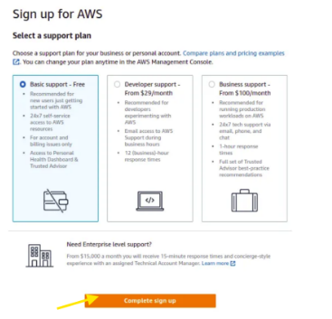

# AWS ACCOUNT CREATION
I went through the proces of setting an AWS account, entering the root email address and password, verifying the email address, entering my contact details, verifying my phone number, choosing a support plan and finally signing up into my account.

