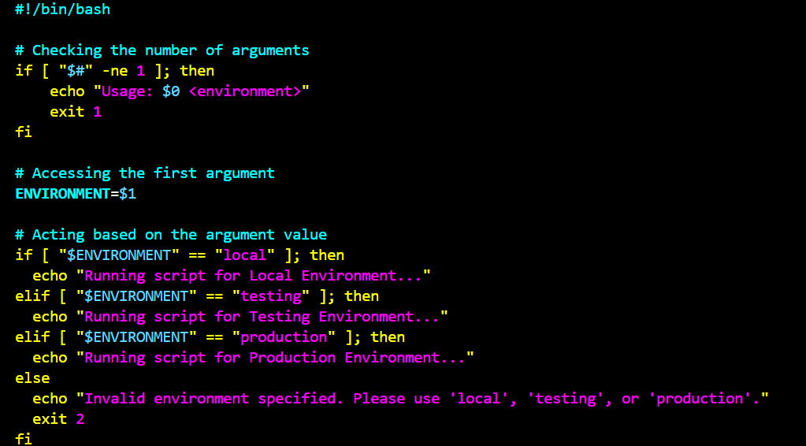

# Understanding Environment Variables and Infrastructure Variables
Infrastructure environments refer to the various settings where software applications are developed, tested, and deployed, each serving a unique purpose in the software lifecycle.

On the other hand, Environment variables are key-value pairs used in scripts to manage configuration values and control software behaviour dynamically

I started off by creating a script file, inputting my script, making the file executable and running the script

Then I used environment variables to apply logic  in the script. I used the export command to set key and values for environment variables and got the following output.

I also tried setting the variable directly within the script

I ran the script and got the following output

I tested using the argument as the value to the variable within the script

I also tried passing multiple parameters to the script and got no change in the output

## Condition to Check the number of Arguments
I added a code to the script to ensure that when the script is executed, exactly 1 argument is passed to it, otherwise it fails with an exit code of 1 and shows a message telling the user how to use the script

I ran the script passing just one argument and got the following output

I tried not passing any argument at all and got the following output

I tried passing more than 1 argument and got the following output

