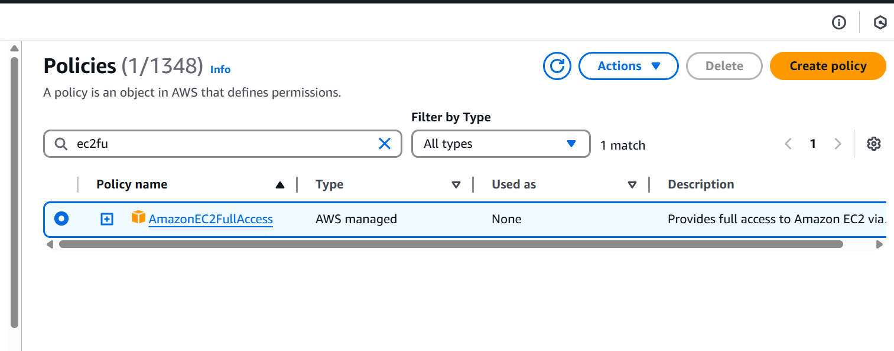
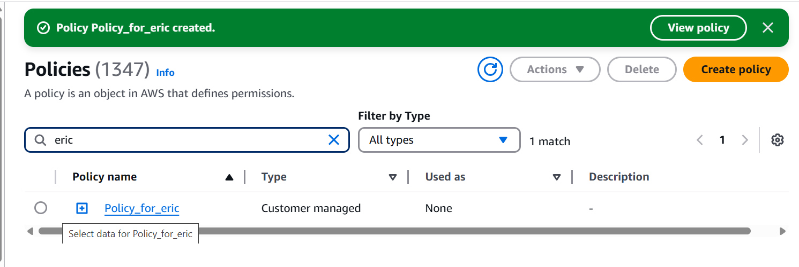
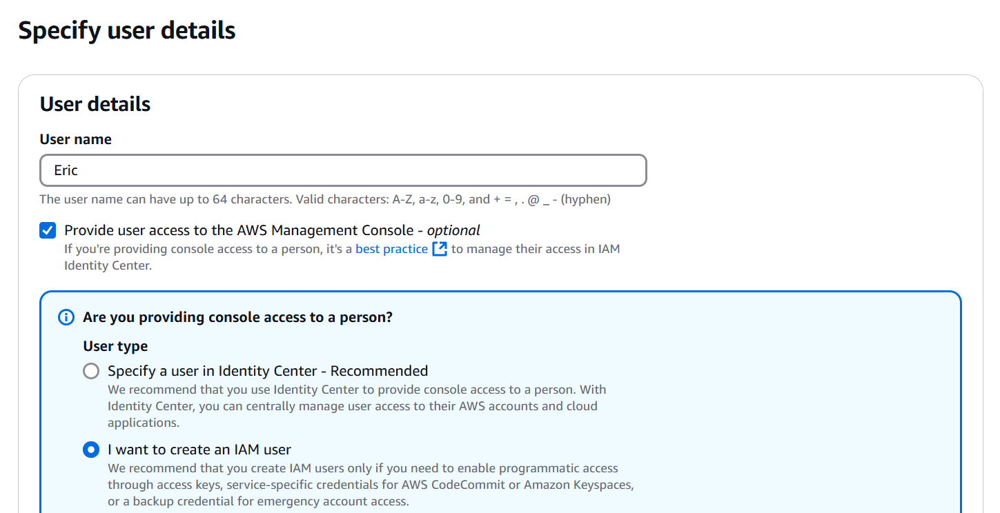
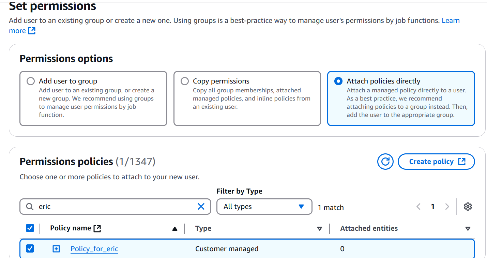
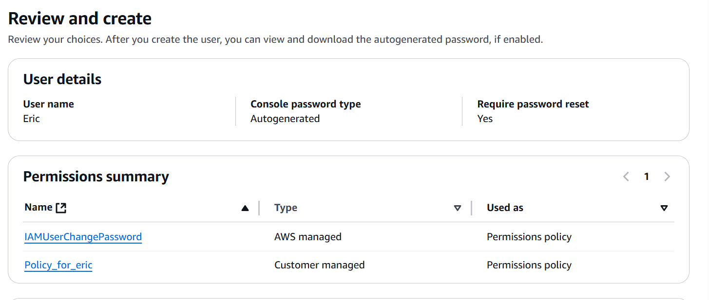
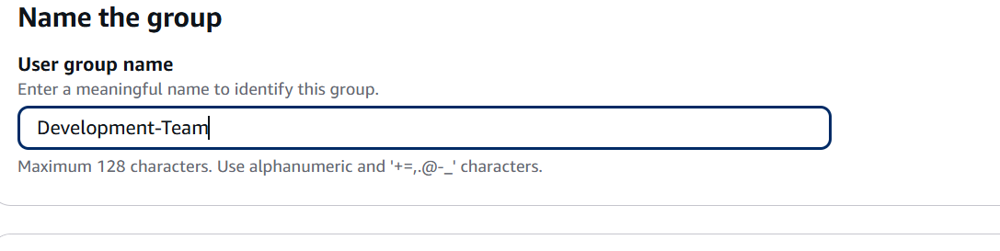
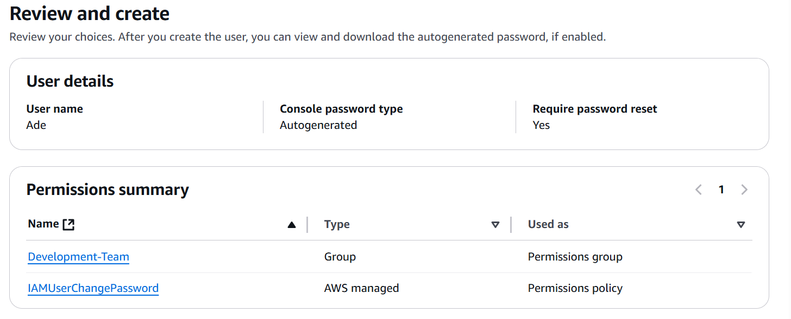
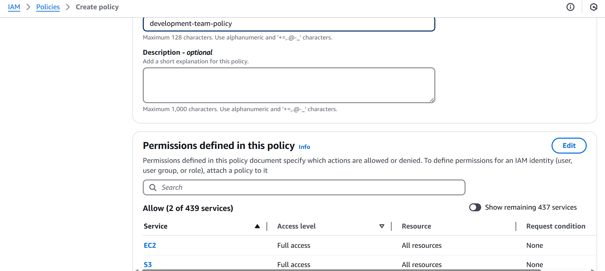
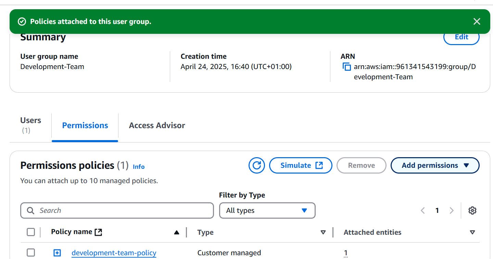

# AWS IDENTIY AND ACCESS MANAGEMENT

I created a policy to grant full EC2 access and named it Policy_for_Eric

I created a user Eric

I attached the Policy_for Eric policy to Eric

I created a User g=Group, Development Team

I created a user Ade and added him to the Development Team Group

I created another policy allowing full S3 and EC2 access and named it development-team-policy

I then attached the policy to the Development Team User Group

