# Load Balancer and Autoscaling Groups
In this project, I learnt how to configure an Autoscaling group in AWS with an Application load balancer using a launch template

I started by creating and configuring launch template settings, including the AMI, instance type, and user data.
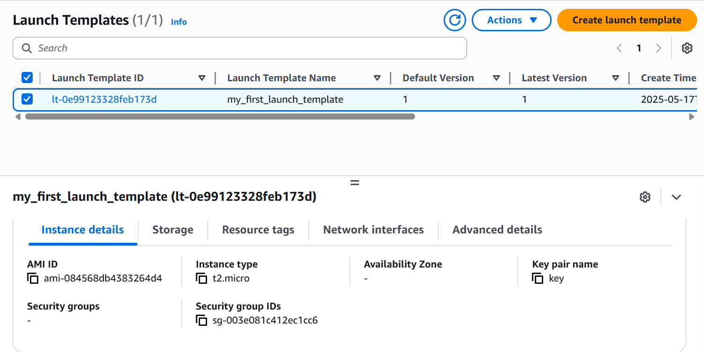

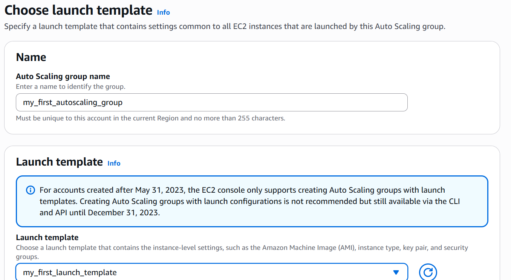

Then I set up Autoscaling Group using the launch template I had earlier created
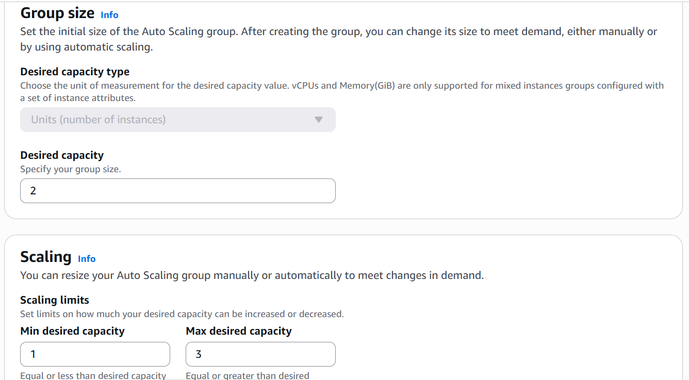

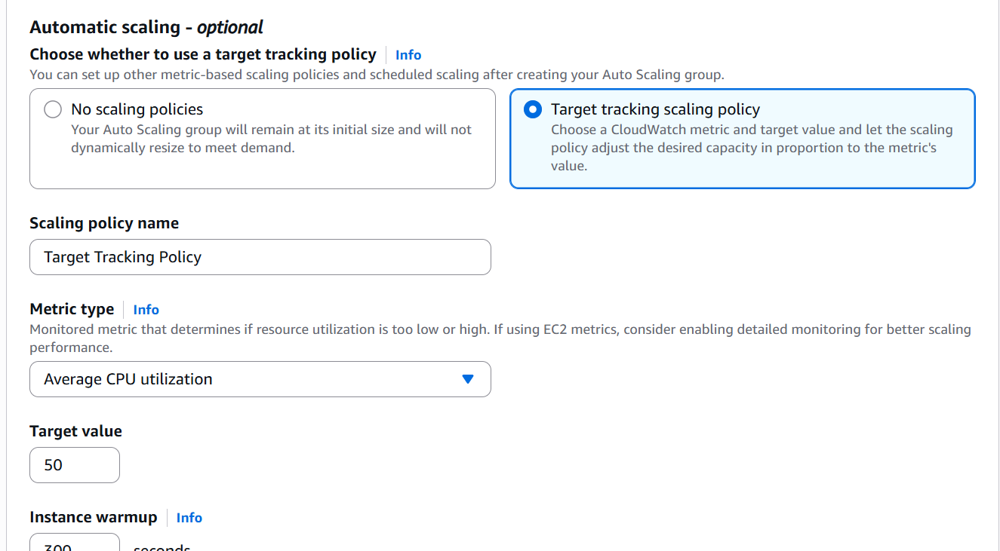

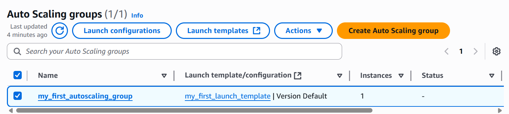

In order to attach an Application load balancer, I created a target group, attav=ched it to the load balancer and attached the load balancer to the autoscaling group
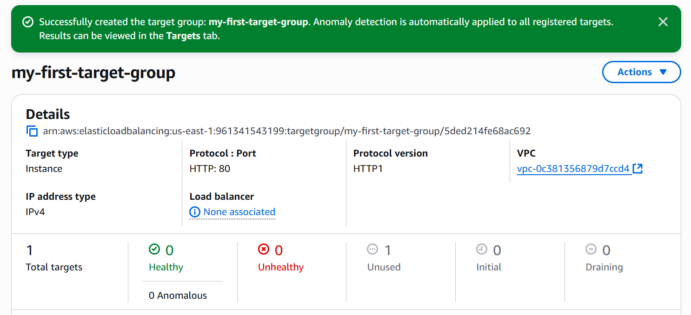

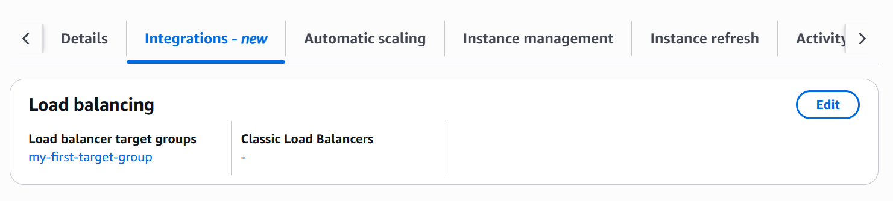

Initially, I did not launch any EC2 instance, but as soon as I configured the Autoscaling group with a desired capacity of 1, an EC2 instance waas immediately spun up
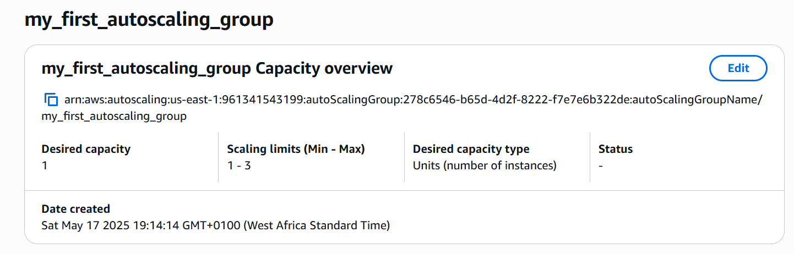
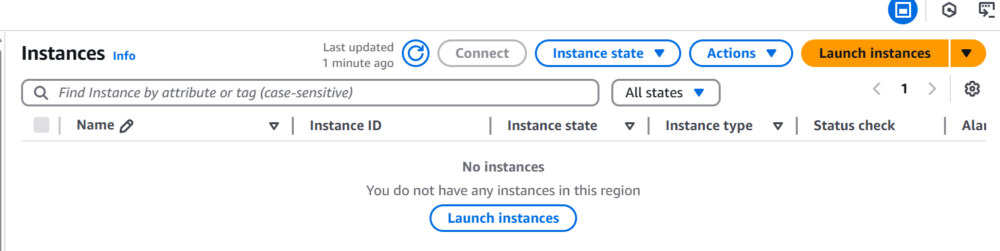

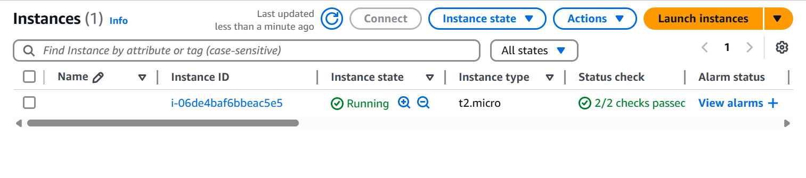

As soon as I introduced the stress command to push the cpu utilization abovr 50%, another instance was launched by the autoscaling group
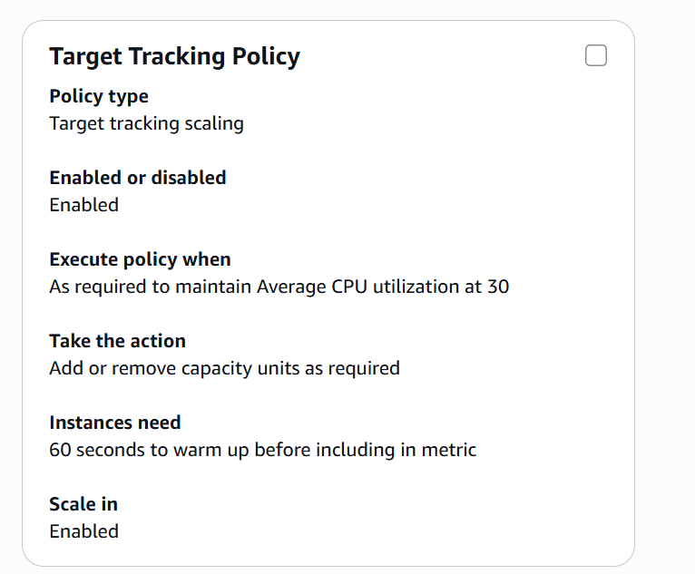
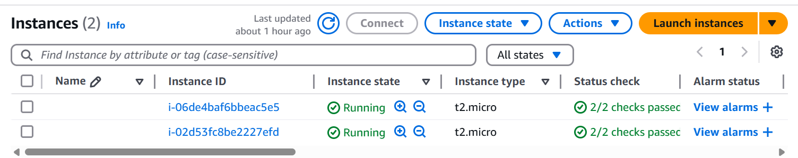