# AWS S3 MINI PROJECT
The goal of this project was to familiarize myself with S3 bucket and it's fundamental concept such as

Firstly, I created an S3 bucket

I made sure public access to the bucket was blocked
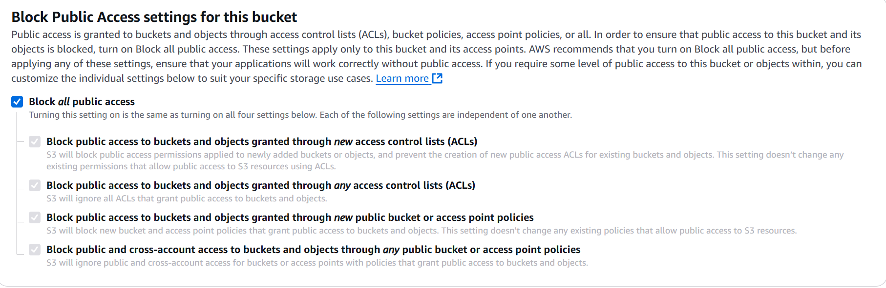
I disabled versioning
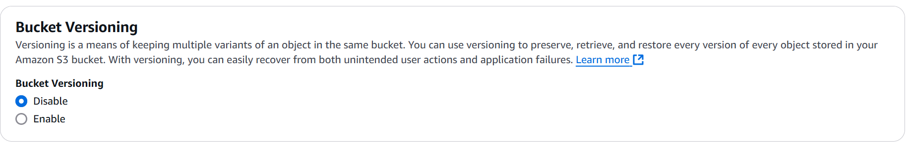

## Uploading file to S3 bucket
I uploaded a file to the S3 bucket
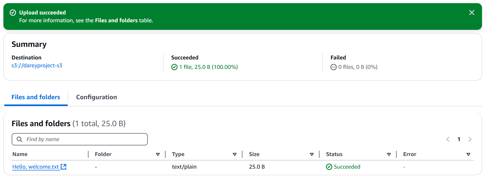
I then editted the properties of the bucket and enabled versioning
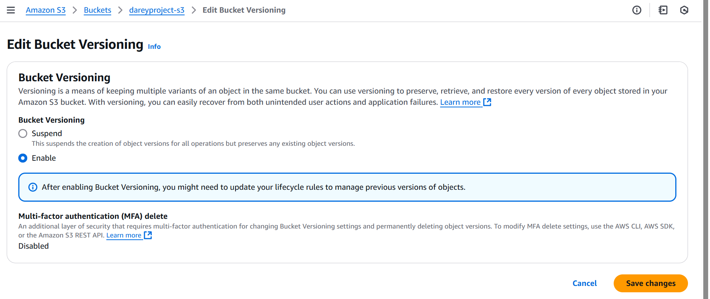
I added another line of text to the initial file and uploaded it to create another version
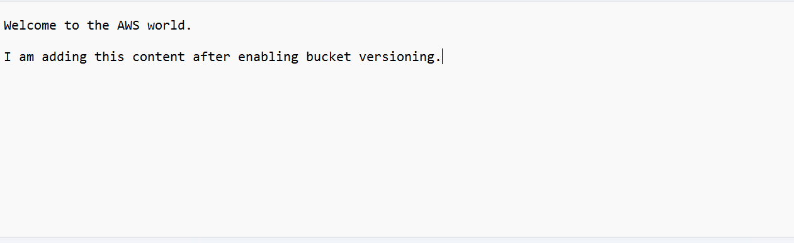
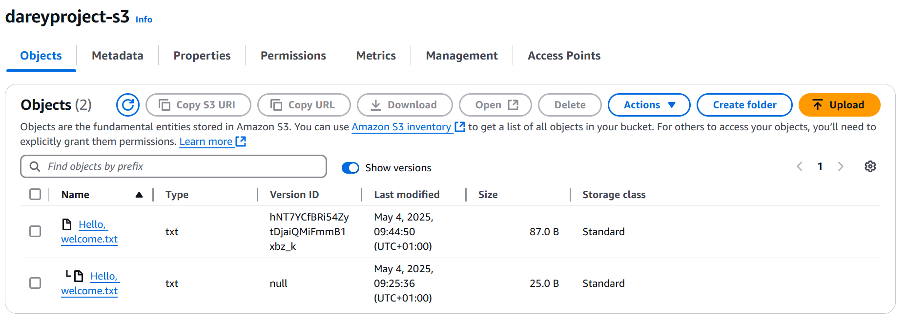

I also enabled public access to the bucket and edited the bucket policy to allow the Getobject and Getobject version statements
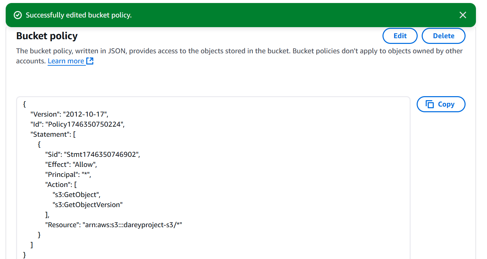
I then clicked on the object url and was able to view the 2 versions of the file
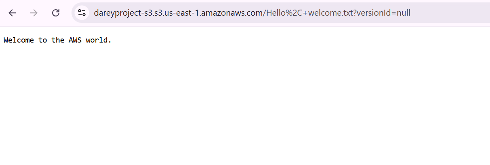
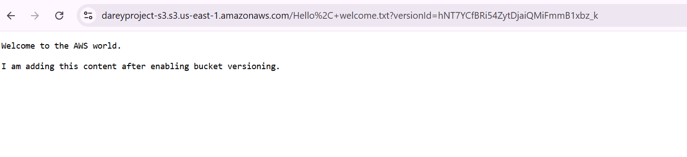
I set a lifecycle policy to transition objects to standard infrequent access after 30days
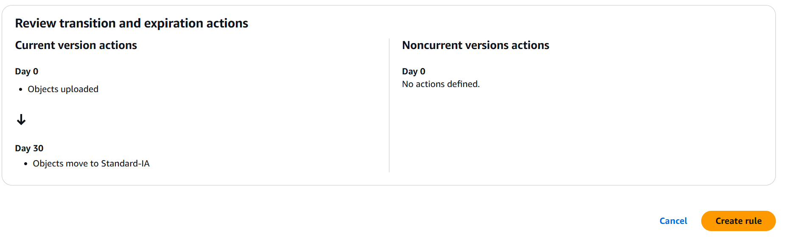
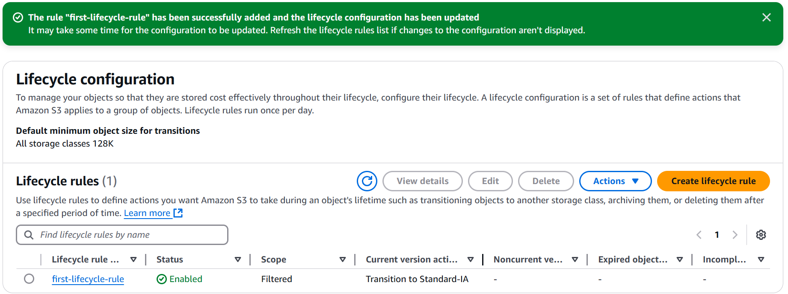