# AWS - SECURITY GROUPS AND NACL OVERVIEW
In this project, I explored how security groups and network control lists function as virtual firewalls to control inbound and otbound traffic in AWS

Firstly, I launched an EC2 instance and only permitted SSH traffic on port 22 to access the instance

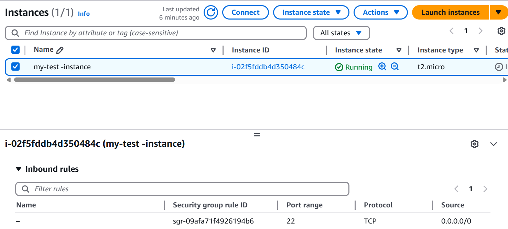

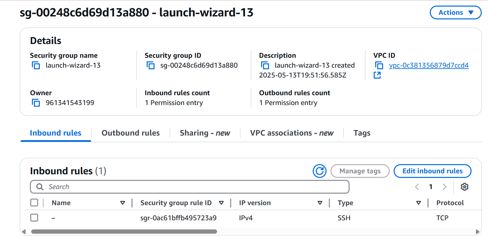

For the outbound rule, I allowed all ipv4 traffic, which means that the instance has unrestricted access to anywhere on the internet
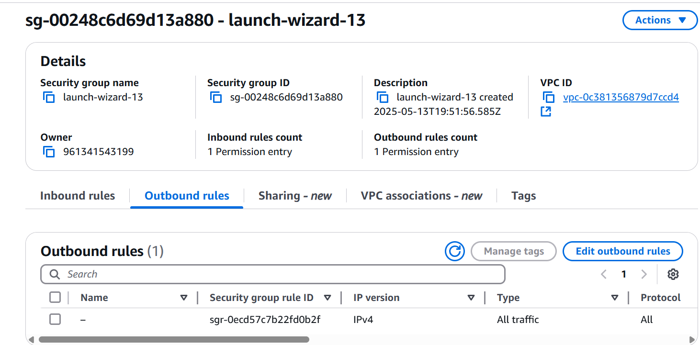

I entered the public ip address of the instance into my chrome browser and the page did not load. this is because I didn't define the http protocol in the security group, so whenever the outside world is trying to access the instance, the security group will restrict it.
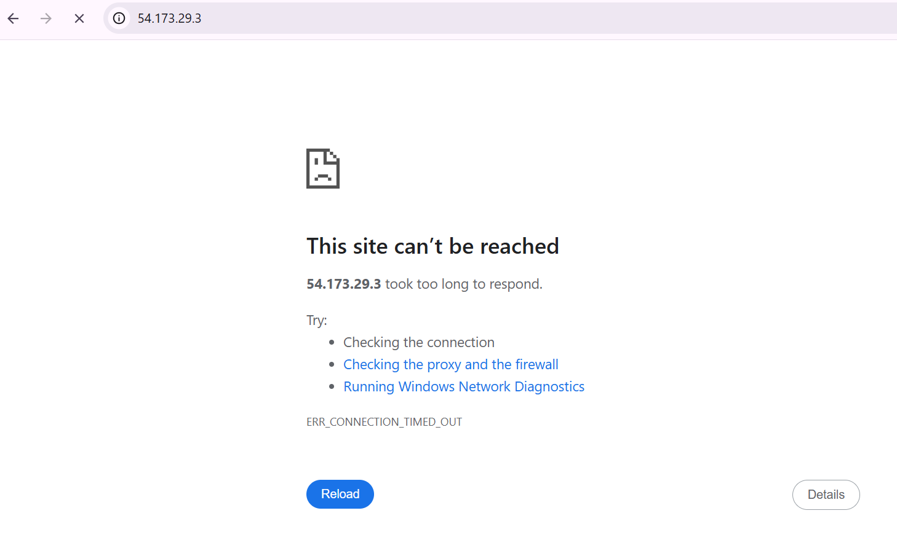

To resolve this issue, I created a new security group that allowed both ssh and http traffic and I attached it to the EC2 instance
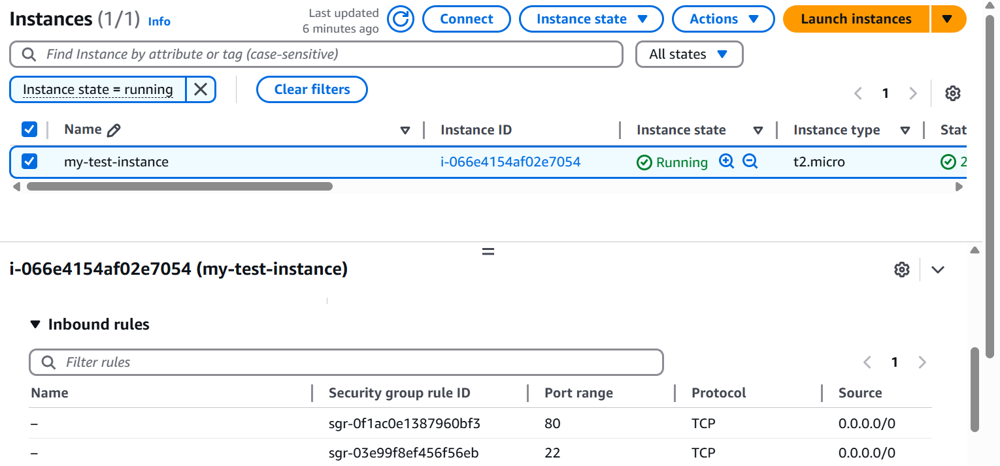

Again, I tried to access the site using the EC2 public ip adreess, and this time I was able to see the data of my website
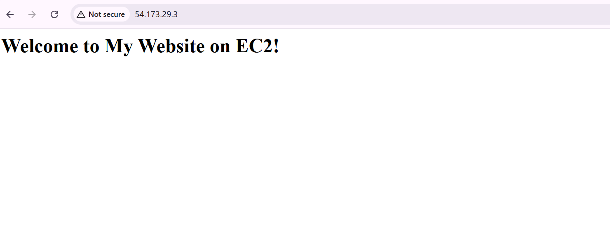

Next, I explored how removing the outbound rule affects the instance's connectivity.
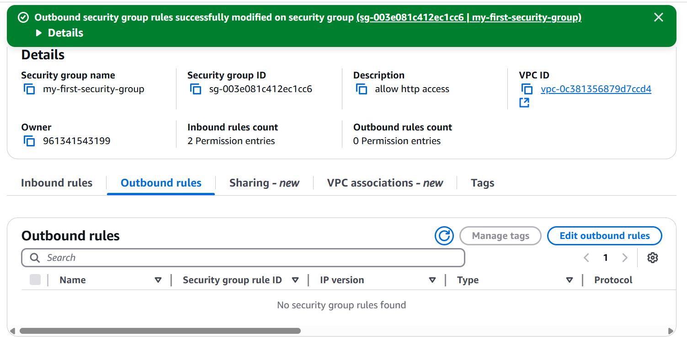

After deleting the out bound rules, I tried to access the site and I was able to. This typically shouldnt be so, since the outbound rule is meant to prevent the website from being displayed. But since, Security groups are stateful, they automatically allow return traffic initiated by the instances to which they are attached.

I also explored deleting the inbound rule
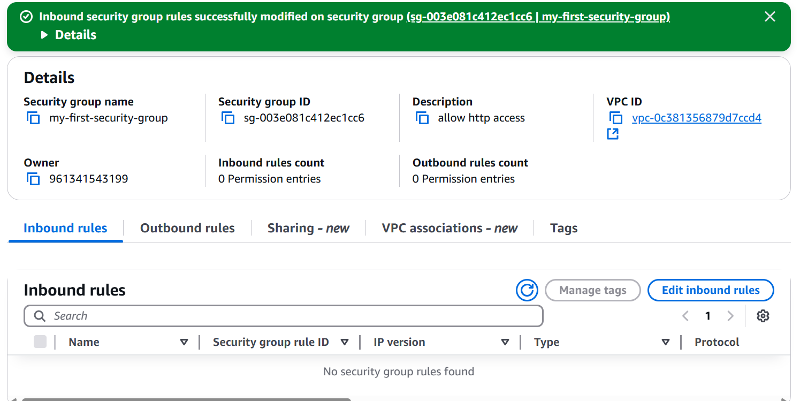

Since both the inbound and outbound rules have been deleted,there's no way for traffic to enter or leave the instance. Therefore, I noticed I wasn't able to access the site. 
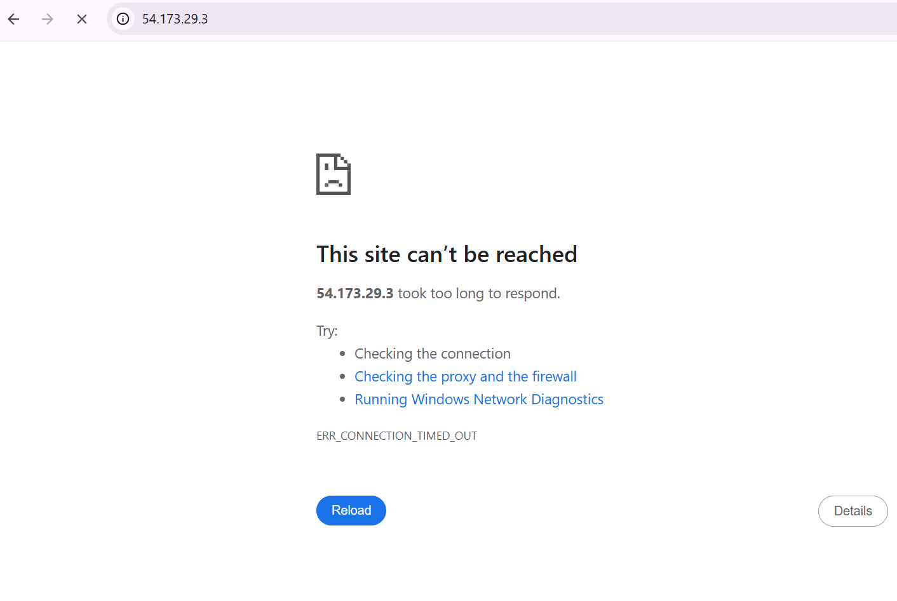

Next, I added a rule specifically allowing http traffic in the outbound rules. This change will enable the instance to initiate outgoing connections over http. The site was still inaccessible. 
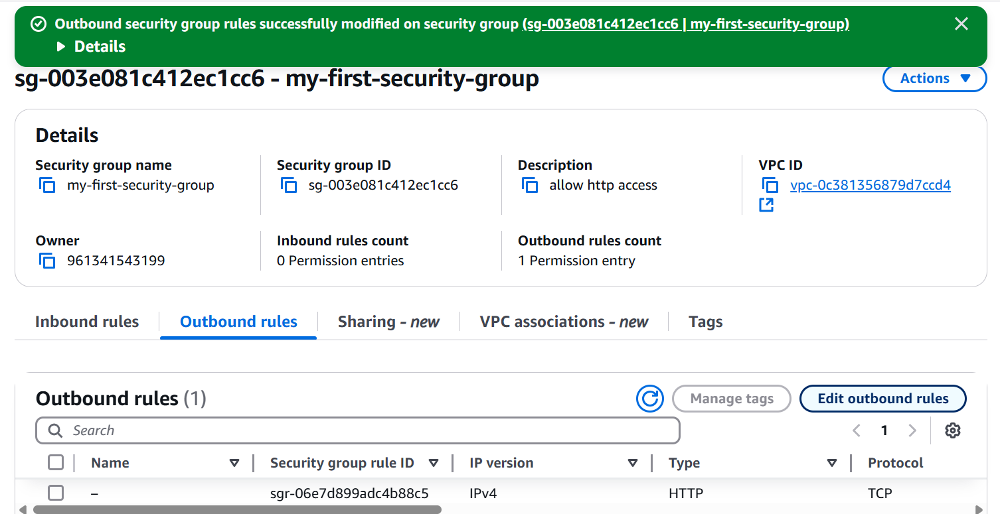

But I was able to go to the outside world from the instance as seen below
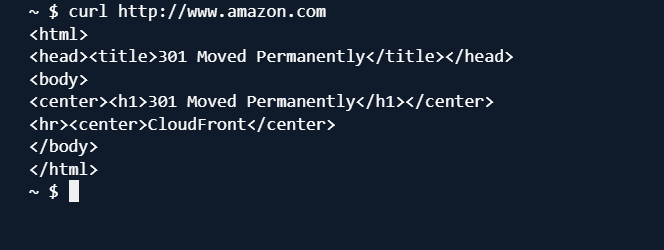

Next I explored NACL functionalities. I created a network ACl and noticed that both inbound and outbound rules were configured to deny all traffic
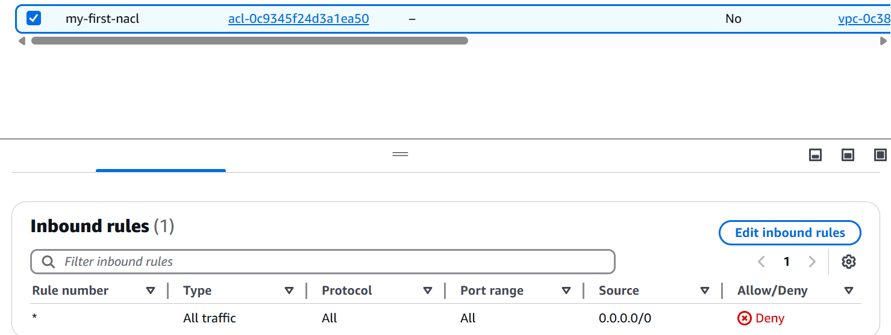
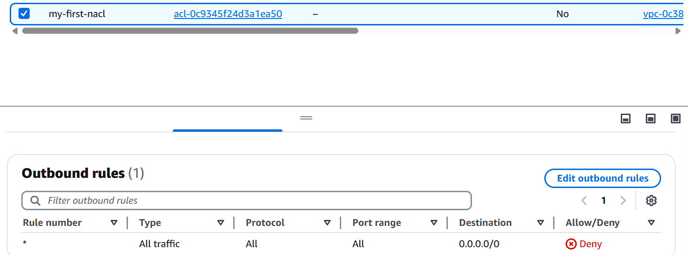

I edited the inbound rule to allow http traffic and associated the NACL with the subnet where the EC2 instance resides. I noticed although I've permitted all traffic in the inbound rule of the NACL, I wasn't still able to access my website. The reason is because NACls are stateless. They don't automatically allow return traffic. As a result, I must explicitly configure rules for both inbound and outbound traffic. So even though the inbound rules allows all traffic into the subnet, the outbound rules are still denying all traffic
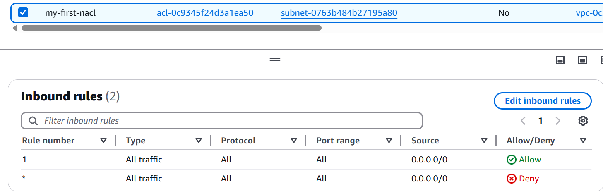
 
 So, I edited the outbound rules to allow all traffic. And I realised I was able to access my website
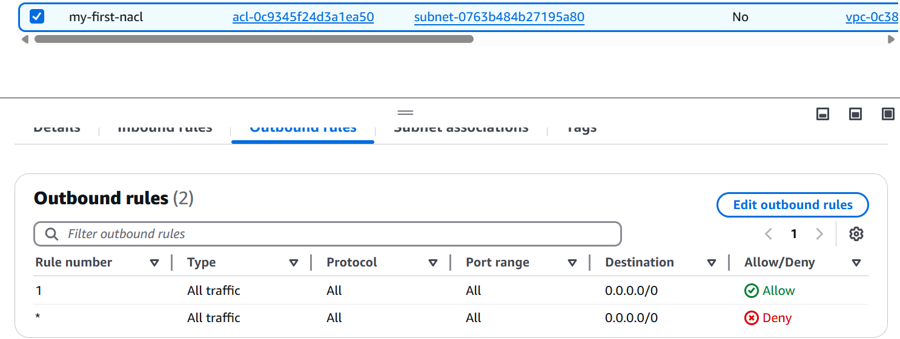

Next, I configured my Security group to allow inbound traffic for http and ssh protocol and permit all outbound traffic

For, the NACL, I configured it to deny all inbound and outbound traffic
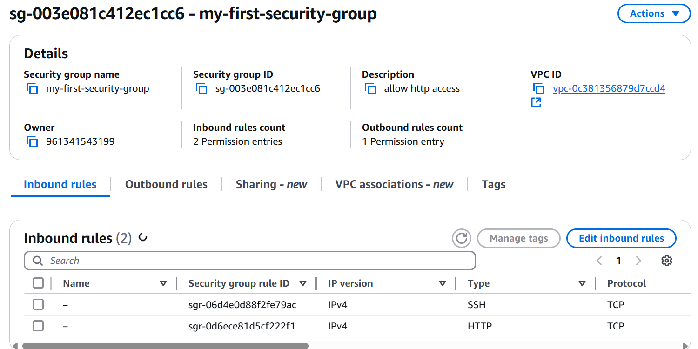

I realised the website was inaccessible. This is because the Nacl has denied inbound traffic. This prevents traffic from reaching the security group.