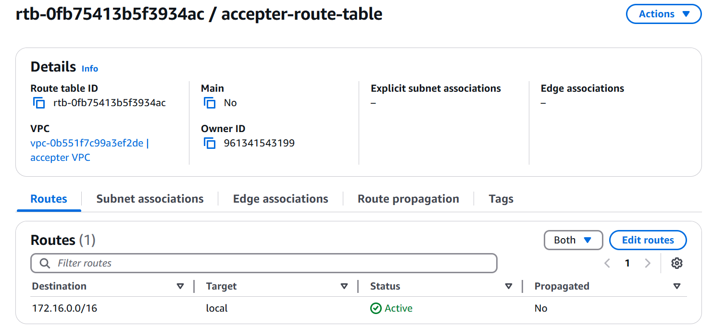
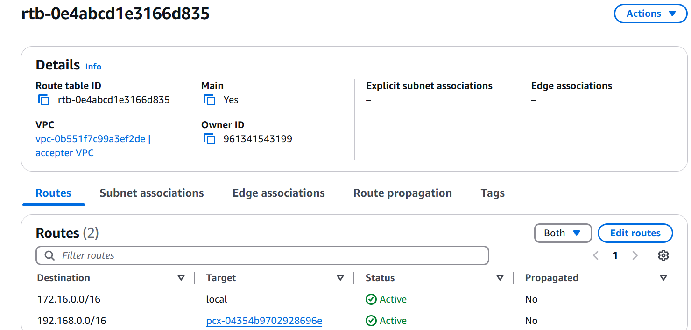

# AWS VPC
In this project, I explored the fundamental components of VPC infrastructure, including subnets, gateways and routing tables.

Firstly, I created a VPC

Then I created a public subnet

I also created an Internet gateway which was in a detached state

I then attached the Internet gateway to my vpc

I created a public route table

In the public route table, I added a route for the Internet gateway to accept traffic from anywhere

Then I associated my public subnet with the public route table

I created a private route table

I associated my private subnet with the private route table

I created a nat gateway in the public subnet

Finally, I added a route to the nat gateway in the private route table

# VPC PEERING
I configured VPC peering to enable comunication between resources in different VPCs

Firstly, I created a requester VPC

Then I created an accepter VPC

I established the vPC peering connection by accepting the connection request

I created a route table for the requester VPC and added the CIDR of the accepter VPC to the route table

Then, I created an accepter route table and added the CIDR of the requester VPC to the route table

