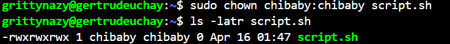

## LINUX ADVANCED COMMANDS
I utilised more complex linux commands and learnt how to use them to grant file permissions, create users, groups and give them ownership of a file or directory

I created a file

I checked the permissions of the file

I updated the permissions to grant execute permissions to the file

I also used the number format to grant permissions

I allowed group members to read, write and execute the file

I used the chown command to grant permission to another user and group

I switched to the root user using sudo and exited

I created a user, and her home directory was automatically generated for her and I assigned her to the sudo group

I switched to another user's account

I changed the password of a user

I created a group

I added users to the created group

I verified the group membership of the user

I deleted a user

I created a group and named it devops

I created some users and ensured each user belongs to the devops group

I created a folder for a user in the /home directory and ensured group ownership of the created folder belongs to devops

I also gave others write permissions
