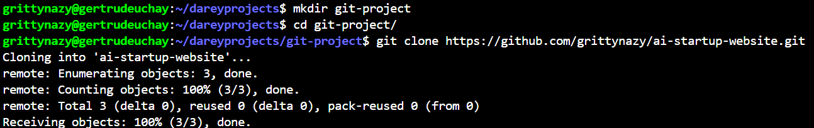
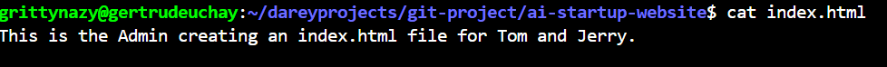
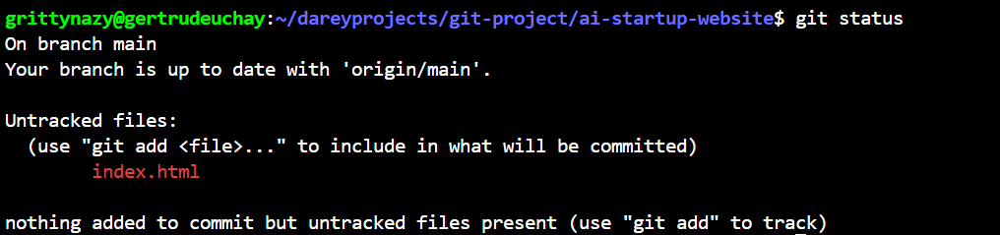
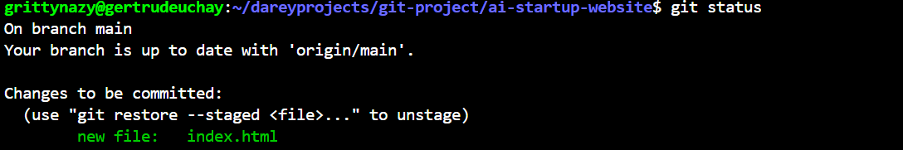
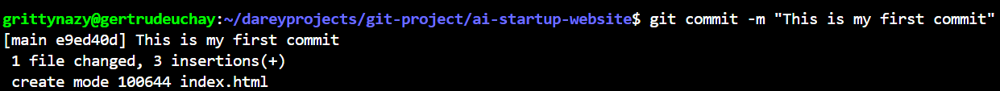
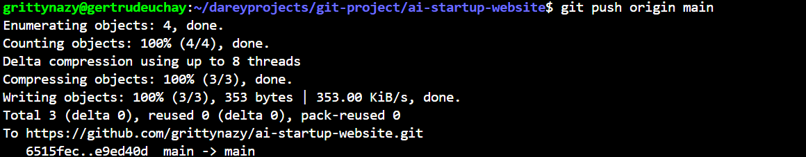

# Collaborative Website Development with Git and GitHub
This project will include installation of git, setting up a Github repository, cloning the repository, creating branches, making changes and merging those changes back to the main branch

# Part 1: Setup and Initial Configuration
## Install Git
Git was installed and confirmed by running the command git --version

# Create a Github Repository
A Github repository was created with the name ai-startup-website

# Clone the Repository
In my local machine, a folder named git-project was created. I navigated to the folder and cloned my github repository into it. 

I navigated to the repository I cloned

I created an index.html file

I inputted a text into thie file

I checked the changes that has not been saved

I staged the changes

I confirmed to see that the status have been successfully saved by checking if the file name has turned to green

I committed the changes

I pushed main branch to Github

# Part 2: Simulating Tom and Jerry's Work
## Tom's Work
I checked the branch that is currently being worked on

I created a new branch called update-navigation and switched to it

I confirmed that I'm currently working on the new branch

I edited the index.html file and updated it

I staged the new index.html file

I committed it and pushed to the remote repository

## Jerry's Work
