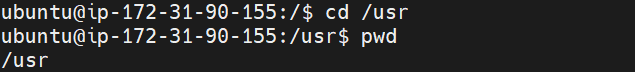
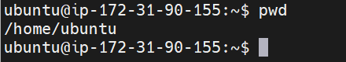

# BASIC LINUX COMMANDS
I will be documenting some basic linux commands and how they are used in the terminal

## Sudo Command
I tried creating a folder in /root directory. This caused a permission denied error

I used sudo to successfully create the folder

I verified the folder's creation using the ls command

I listed the files and directories in the root file system

I used the cd command to navigate to one of the directories in the output above

## pwd
I used the pwd command to find the path of my current working directory

I created a folder in /usr 

I created 3 more random directories inside the photos directory

I utilized the ls command to list the content of the directory

## cat command
I used the cat command to list the content of a file

## cp command
I used the cp command to copy the content of a file into a directory

..to copy multiple files into a directory

..to copy one file into another file

..and to copy an entire directory into a destination directory

## mv command
This can be used to move a file from one directory to another

..or rename a file

## rm command
I used the rm command to delete a single file as well as multiple files

## touch command
I used the touch command to create a file

## find command
I used the find command to search for files within a directory
