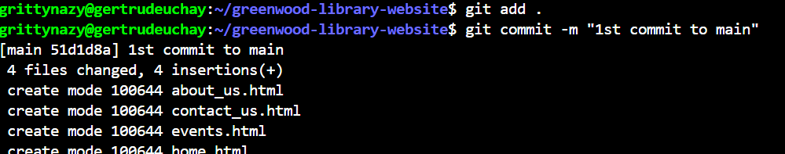
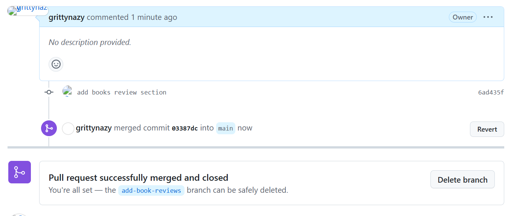

# CAPSTONE-GIT PROJECT
## Setup
I created a repository on Github, named it greenwood-library-website and initialized a Readme file

I cloned the repository into my local machine

## Tasks
In the main branch, I created 4 files and added texts in them

I staged the files and committed them

I then pushed the files to the Github repository on the main branch

## Morgan's Work
I created a new branch name add-book-reviews and switched to it

I created a file and put some content in it

I staged and committed the files

I then pushed to my Github repository on the add-book-reviews branch

I created a pull request and merged the changes to the main branch

## Jamie's Work
I created a new branch name update-event and switched to it

I created a file and put some content in it

I staged the changes made and committed them

I pulled the latest changes from the main branch into update-events branch

I pushed to my Github repository on the update-events branch

I created a pull request and merged the changes to the main branch

