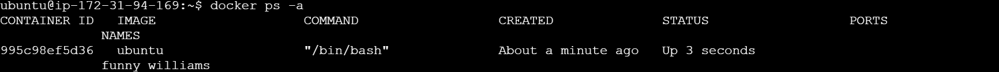

# Working With Docker Containers

Docker containers are lightweight, portable, and executable units that encapsulate an app and its dependencies.

### Running Containers
I started by first pulling the image

To run a container, I used the docker run command followed by the name of the image

The image below show that the container was created but not running

I started the container by running docker start container_id

I ran a command that prints all available system information in one line. It gives you a comprehensive overview of the system’s kernel and operating system.

### Launching containers with different options

Here, I ran a container with a specific environment variable

### Running containers in the background
I also ran a container in the background, using the -d option

### Container Lifecycle
Containers have a lifecycle that includes creating, starting, stopping, and restarting. 

Here, I started the container using the image name and got an error message

I then started the container using the container name and it worked

This is the evidence of the running container

I stopped the container

And confirmed by running the docker ps -a command

And also restarted the container

Finally, I removed the container and confirmed it by running the docker ps -a command

