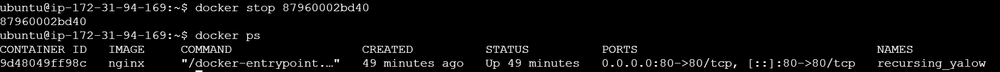

# Working with Docker Images
Docker images are the building blocks of containers.  
Docker Hub is a cloud based registry that hosts a vast collection of Docker images

I tried to find the ubuntu image on Docker Hub

I downloaded the official ubuntu image to my local machine and viewed a list of the images on my machine

I created a Dockerfile by specifying a base image, defining the working directory, copying files, installing dependencies and configuring the runtime environment

I created an index.html file in thesame location as the dockerfile

I created the image and tagged it using the docker build command and confirmed the image creation

I then ran a container based on the custom NGINX image I earlier created

I tried accessing the site and wasn't able to

I then editted the inbound rules of my EC2 instance and opened port 8080 to anywhere

Then, I was able to access the site

I stopped the container using the docker stop command and the site became inaccessible

I also restarted the container using docker start command

Then I tagged the image to match my docker hub repository

I then logged into the docker hub registry using my username and password

I then pushed my custom image to docker hub

And confirmed the push by logging into docker hub from my browser

