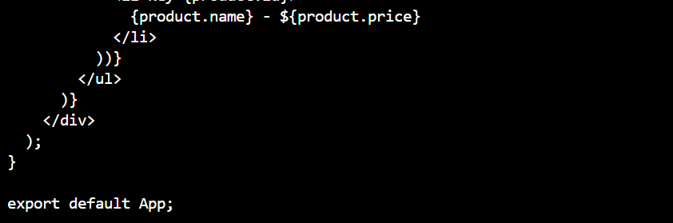

# E-Commerce Application CI/CD Pipeline

In this project, I set up a simple Node.js/Express application that handles basic E-commerce operations and implemented unit tests for my API. I created a simple React application that interacts with the backend API. I ensured the frontend has basic features like product listing, user login, and order placement. I then wrote a Github Actions workflow for the backend and frontend that installs dependencies, runs tests, and builds the application. I created docker files for both the backend and frontend and modified my github actions workflow to build docker images. I then configured Github Actions to deploy the docker images to AWS

Firstly, I created a Github repository

Then I cloned the repository into my local machine, created a backend directory and created a server.js file in it

I also created the test directory and an app.test.js file

I then created a react frontend and ran all the necessary commands

This is the app.js file

I added the necessary tests for the application

I then created the .github/workflows directory which had 3 workflows: backend.yml, frontend.yml and deploy.yml workflow files

I then created Dockerfiles for both backend and frontend 

I tested the backend locally and it opened on the browser. I also opened the product listing page successfully, same with the login and order pages

I then built the frontend docker image and tried to open the link on the browser

Then I updated my src/app.js file

I then created a docker compose file and ran the container

My e-commerce app was tested locally and everything seemed fine

I then logged into docker and pushed my images to docker hub

I created an AWS EC2 instance for the deployment and adjusted the security group to listen to port 3000, 5000, 22 and 80

I inputted the following secrets in Github so my deploy.yml file can run successfully

I then added, committed and pushed my changes and the e-commerce application got automatically deployed to AWS EC2

