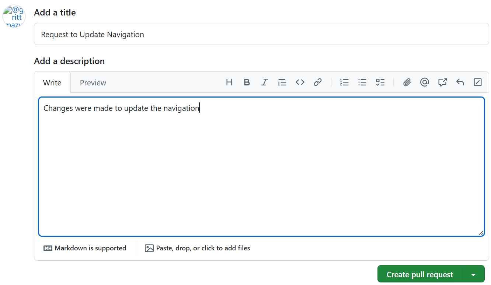
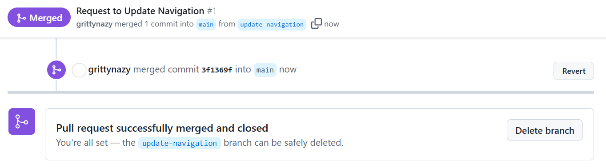
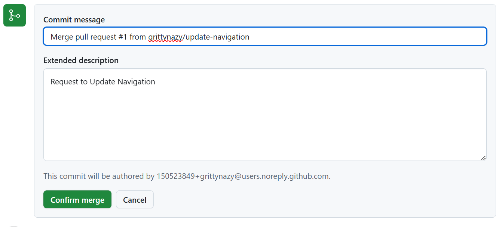

# Git Branching and Merging
This project focuses on creating pull requests and merging requests to main

## Switch branch
I navigated to my repository and switched branch to update-navigation

## Create pull request

## Merge request
I reviewed the pull request from Tom's branch and merged it with the main

# Updating Jerry's Branch with Latest changes
On the terminal, I switched to Jerry's branch

I pulled the latest changes from main branch

I then pushed the changes to Github
