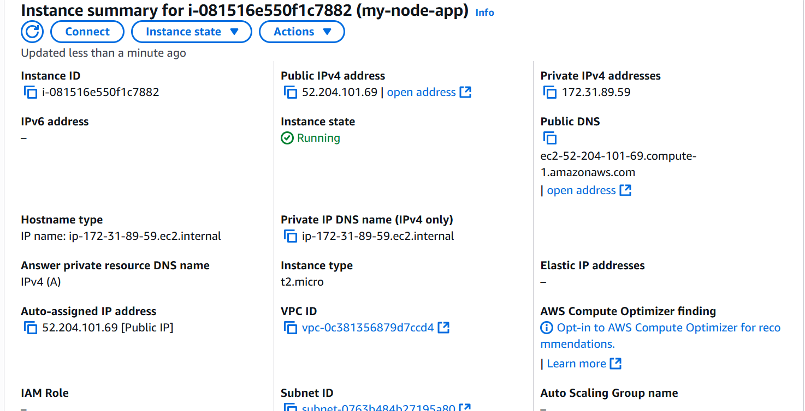

# Introduction to Continuous Introduction and Continuous Deployment

Firstly, I initialized a github repository, created it and cloned it to my local machine

I initialized a node.js project, created a simple server using Express.js to serve a static web page and added the code to the repository and pushed it to Github. I also added automated tests for my application using Mocha and chai

I created a .github/workflows directory and added a workflow file nodejs.yml

This is my index.js file

I created a test folder and an app.test.js file

I tested my app and it passed

I pushed the changes to github and the job ran successfully

I created an EC2 instance, cloned my app repository into it and tested the app

I created a key in my local machine, copied the publick key and added to github secret

I also created a deployment workflow file for deployment to AWS and pushed the changes to github

I made some changes to the code to see if the pipeline would run smoothly

I tested the app locally first and then pushed the changes to github

The changes reflected on AWS

I implemented matrix builds to test across muktiple versions in order to increase efficiency

#### Adding Code Analysis Tools
I also integrated code analysis tools into the Github Actions workflow

#### Configuring linters and Static code Analysis
I ensured my repository included configuration file for .eslintrc

I then pushed the cchanges to github

#### Automated Versioning with Github Actions
I implemented automated versioning to increment version numbers automatically based on code changes. The action below will automatically increment a patch version and create a new tag each time changes are pushed to the main branch

#### Automating Releases
I setup my workflow to create a new release whenever a new tag is pushed to the repository

I had to change the settings on my github repo to allow workflows have read and write permissions and allow github actions to create and approve requests.

I pushed my commit with the version tag
 and the pipeline ran successfully

