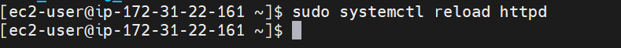

# E-COMMERCE PLATFORM DEPLOYMENT WITH GIT, LINUX AND AWS
 In order to achieve this deployment, I started with the initializing of git
 

 I downloaded a website template and extracted the downloaded template into my project folder

 

 

 

 
 
 I added the website files to my git repo, set the git global configuration with my username and password and committed the changes
 

 I created a remote repository on Github and linked my local repository to the remote
 
 

 I then pushed the changes to Github
 

 ## AWS DEPLOYMENT
 To deploy the website, I started with setting up an EC2 instance. I logged into the AWS Management console, launched an EC2 instance using an Amazon Linux AMI and connected to the instance via SSH
 

I cloned the Github repo to my EC2 instance using the 2 primary methods: SSH and HTTPS.

### SSH
On my EC2 instance, I generated SSH keypair using ssh-keygen

I displayed and copied my public key

I added the public key to my Git hub account

 I navigated to my Github repo and selected code and then SSH and copied the link

I used the SSH clone URL to clone the repository

### HTTPS
I navigated to my Github repo and selected code and copied the HTTPS link. I used this to clone the repo also

## Install a Web Server on EC2
I installed Apache web server on the EC2 instance

I then cleared the default httpd web directory and copied my website files to it

I applied the changes by reloading the httpd service

I opened a web browser and accessed the public ip of my EC2 instance to view the deployed website

## Development New Features and Fixes

I created a development branch to isolate new features

I staged my changes, committed pulled and pushed.

