# Introduction to Docker
In this project, I got started by installing docker. Firstly, I refreshed the package list ensuring the latest software is available for installation.
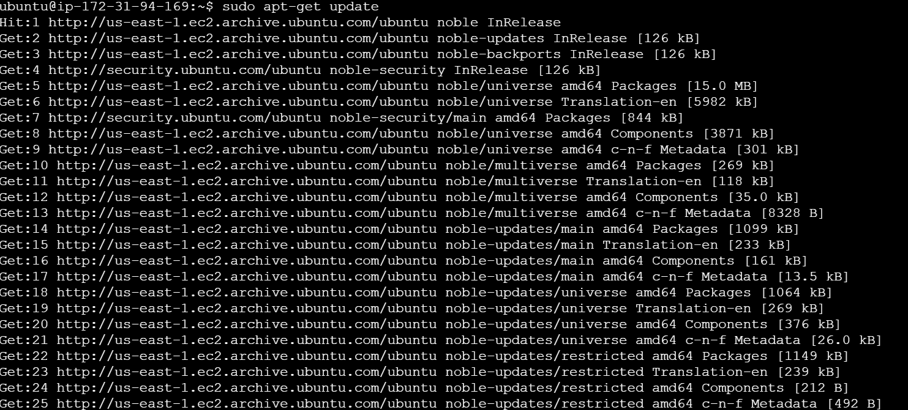

Then I installed essential packages, including certificate authorities, a data transfer tool (curl), and the GNU Privacy Guard for secure communication and package verification.
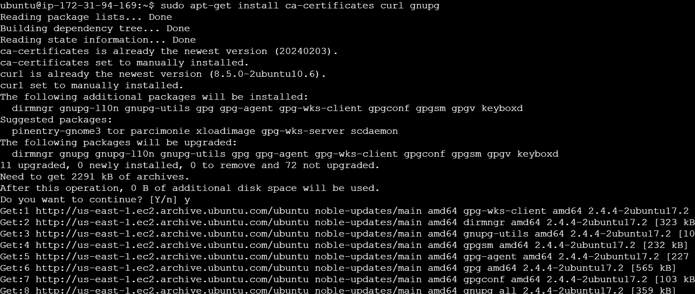

I created a directory which is used for docker's authentication,downloaded the docker GPG key and set read permissions for all users on the docker GPG key file within the APT keyring directory. I then used the echo command to create a docker APT repository configuration entry for the ubuntu system and wrote this configuration to the docker.list file
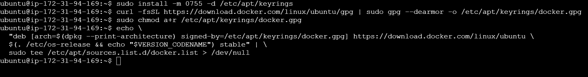

I then installed the latest version of docker 
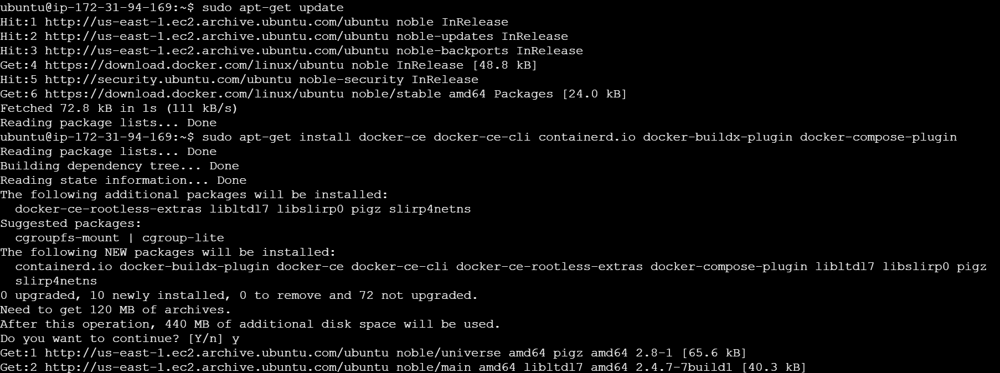

I verified that docker has been successfully installed
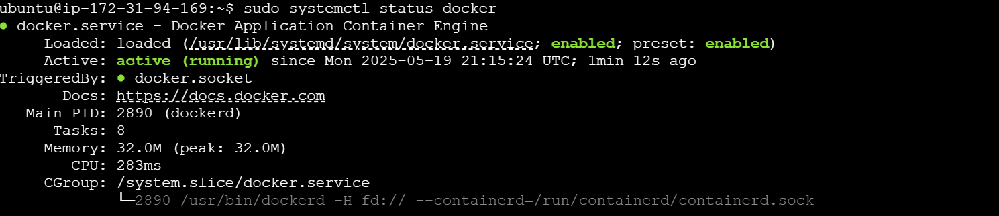

I used the docker run command to execute a "Hello World" container
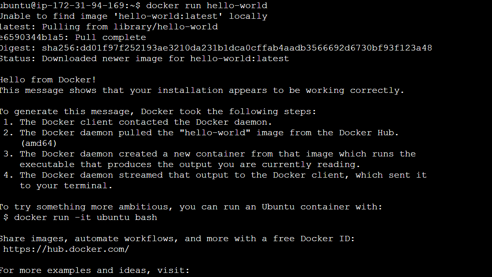

I checked if the images are present in my local machine
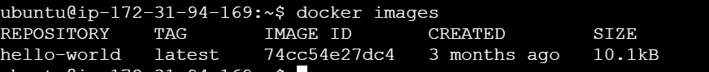

The docker ps command shows the containers running while the docker ps -a command shows all containers whether running or stopped
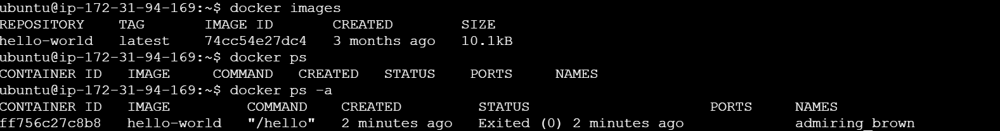

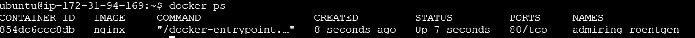

docker stop commands stops a running container while the docker rm command deletes a container and docker rmi command deletes an image
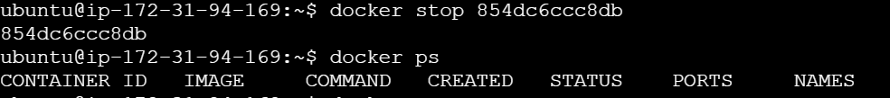

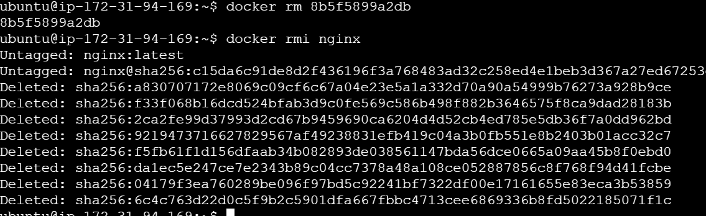