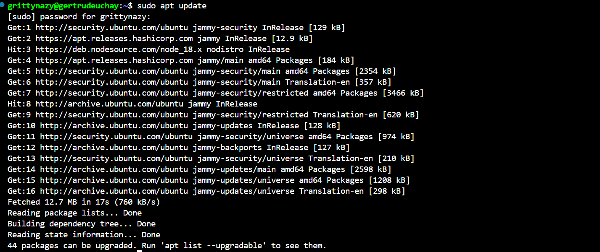
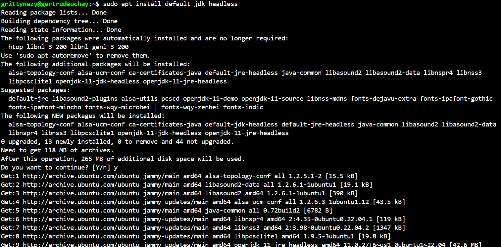
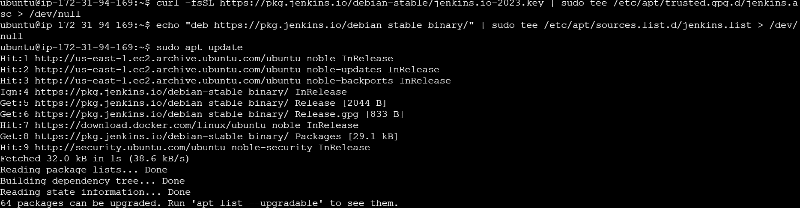
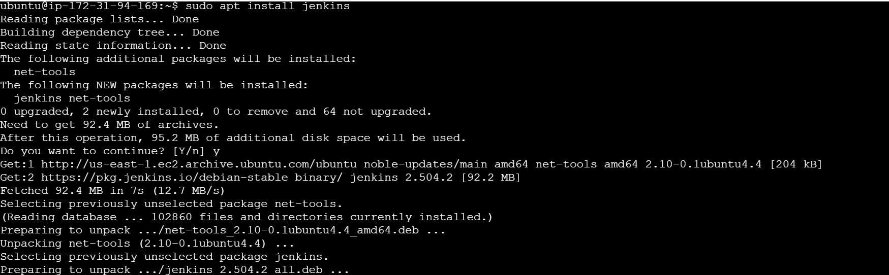
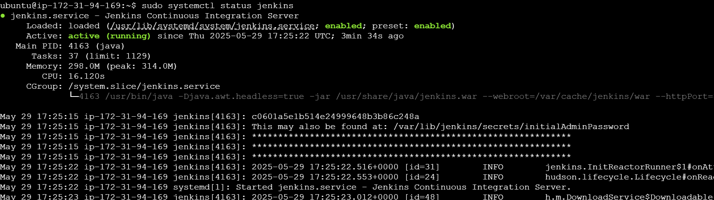
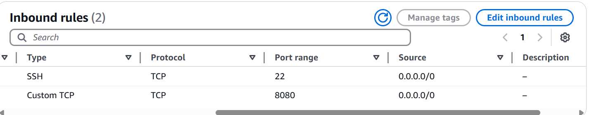
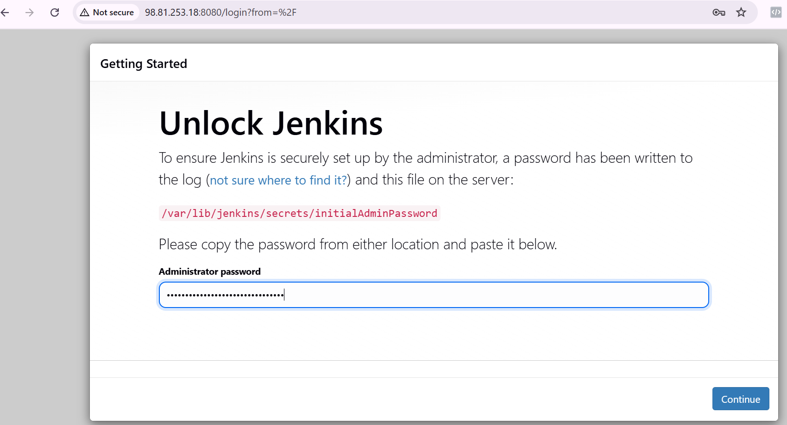
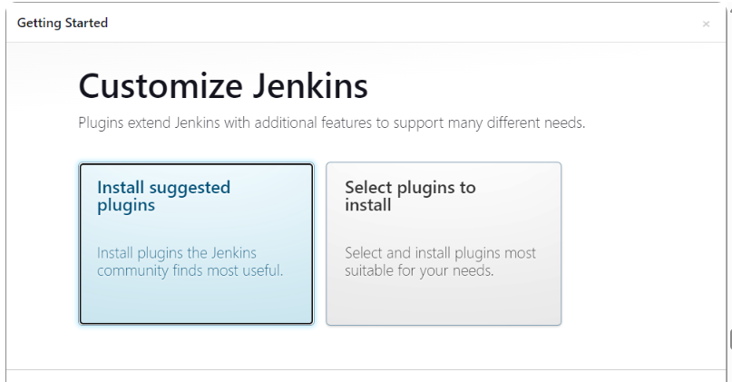
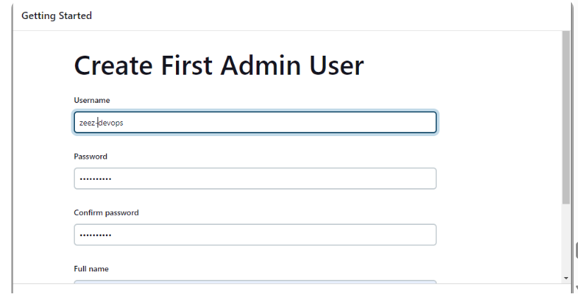
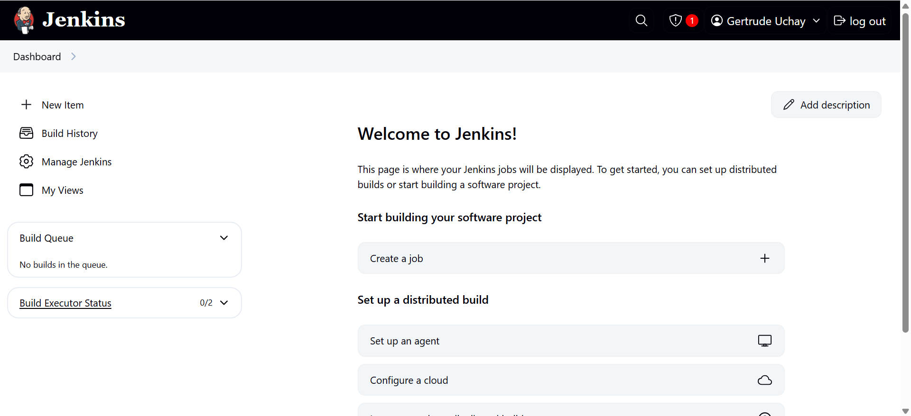

# Introduction to Jenkins
Jenkins is used to automate building, testing and deploying applications, streamline the development lifecycle.

### Installing Jenkins
Firstly, I update package repositories, installed jdk and installed jenkins

 I confirmed that jenkins was running and is up and running

I then opened port 8080 on my EC2 instance Security group, since jenkins listens on port 8080

On the jenkins instance, I checked to know the admin password

I inputed the jenkins ip address on my web browser and filled in the password gotten previously

I installed the suggested plugins

and created the first admin user

This is the newly created admin profile on the jenkins console

