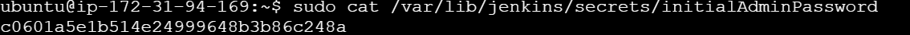

# Introduction to Jenkins
Jenkins is used to automate building, testing and deploying applications, streamline the development lifecycle.

### Installing Jenkins
Firstly, I update package repositories, installed jdk and installed jenkins

 I confirmed that jenkins was running and is up and running

I then opened port 8080 on my EC2 instance Security group, since jenkins listens on port 8080

On the jenkins instance, I checked to know the admin password

I inputed the jenkins ip address on my web browser and filled in the password gotten previously

I installed the suggested plugins

and created the first admin user

This is the newly created admin profile on the jenkins console

## Creating first build job
On the dashboard, I clicked on new item and created a freestyle project named my-first-job

I created a new repository on Github and copied the code

I then inserted the github repo link in jenkins 

I changed the branch from master to main and started the build

This is the status of the manual build

I then set the build trigger on Jenkins to automatically run a build when a change is made to the repo, comitted and pushed

I configured Github webhooks to make sure Jenkins is receiving webhook POST requests from GitHub

After configuring the webhooks, I made a change to the README file, and a build was automatically run in Jenkins

