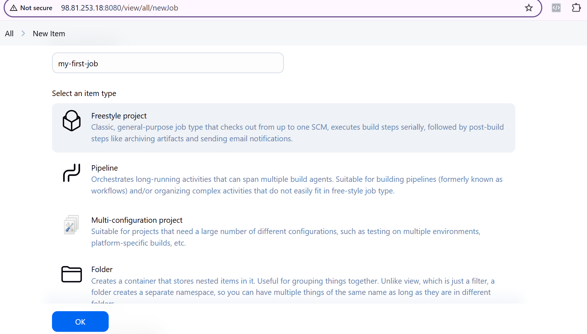
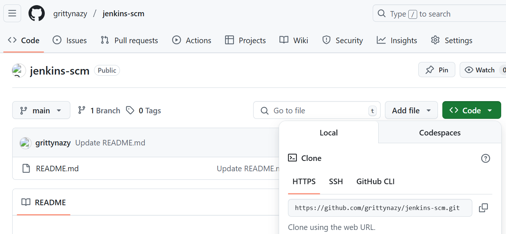
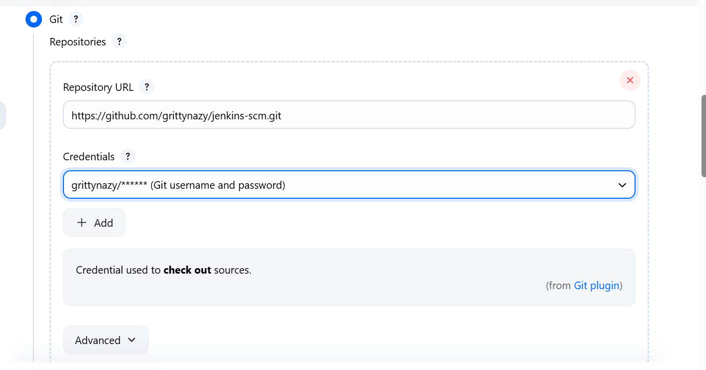
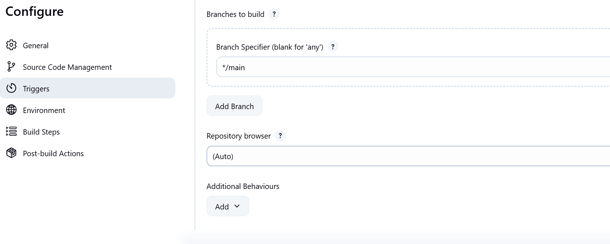
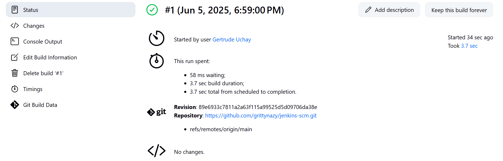
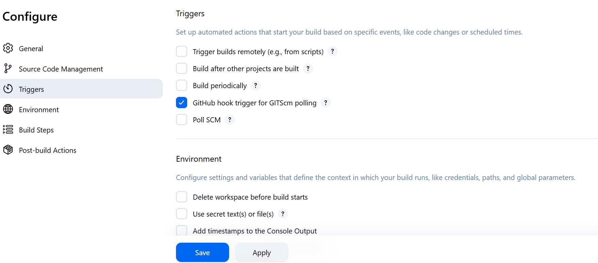
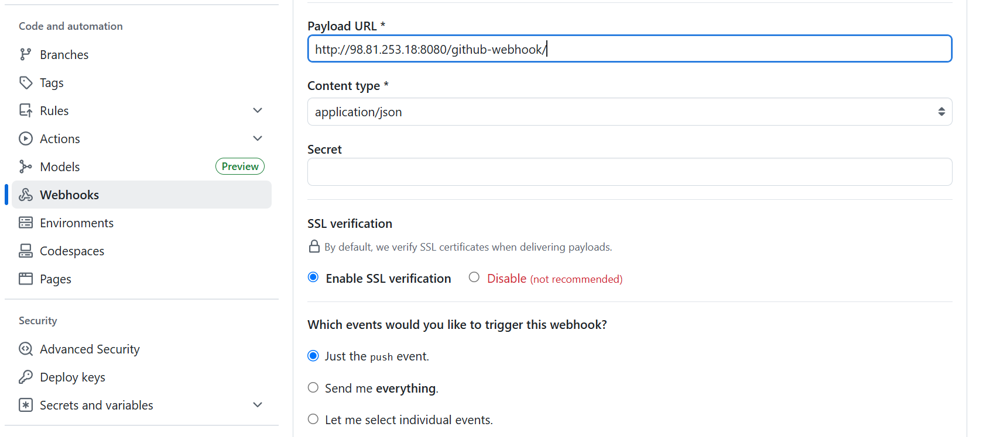
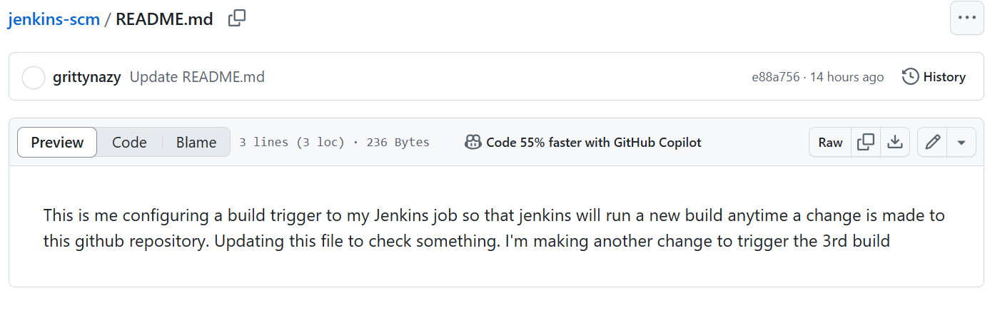
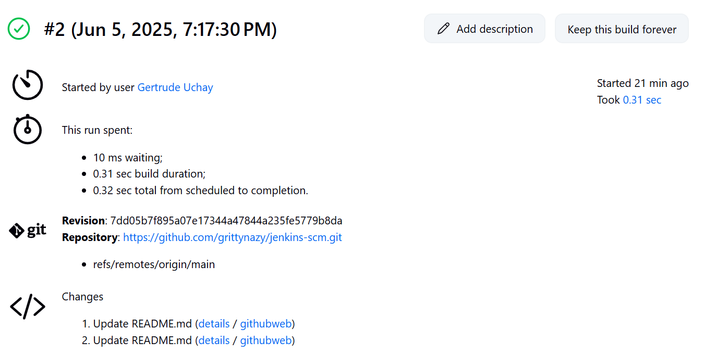

# Jenkins Freestyle Project
In Jenkins, a job is a unit of work or a task that can be executed by the Jenkins automation server

## Creating first build job
On the dashboard, I clicked on new item and created a freestyle project named my-first-job

I created a new repository on Github and copied the code

I then inserted the github repo link in jenkins 

I changed the branch from master to main and started the build

This is the status of the manual build

I then set the build trigger on Jenkins to automatically run a build when a change is made to the repo, comitted and pushed

I configured Github webhooks to make sure Jenkins is receiving webhook POST requests from GitHub

After configuring the webhooks, I made a change to the README file, and a build was automatically run in Jenkins

