# Jenkins Pipeline Job
A jenkins pipeline is a way to automate and define a series of steps in the software delivery process

Firstly, I created a pipeline job and configured the build trigger
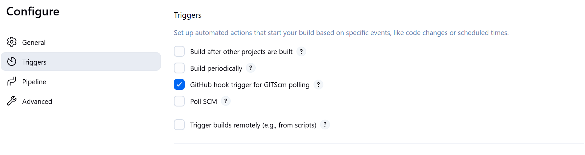

Then I inputted the declarative jenkins pipeline script below

pipeline {
    agent any

    stages {
        stage('Connect to GitHub') {
            steps {
                checkout([$class: 'GitSCM',
                    branches: [[name: '*/main']],
                    extensions: [],
                    userRemoteConfigs: [[
                        credentialsId: 'Git-pw',
                        url: 'https://github.com/grittynazy/jenkins-scm.git'
                    ]]
                ])
            }
        }

        stage('Build Docker Image') {
            steps {
                script {
                    sh 'docker build -t dockerfile .'
                }
            }
        }

        stage('Run Docker Container') {
            steps {
                script {
                    sh 'docker run -itd -p 8081:80 dockerfile'
                }
            }
        }
    }
}

I made the script checkout from version control, connected my github repo to it with the appropriate Personal access token, and generated the pipeline script which was inputted into the original script
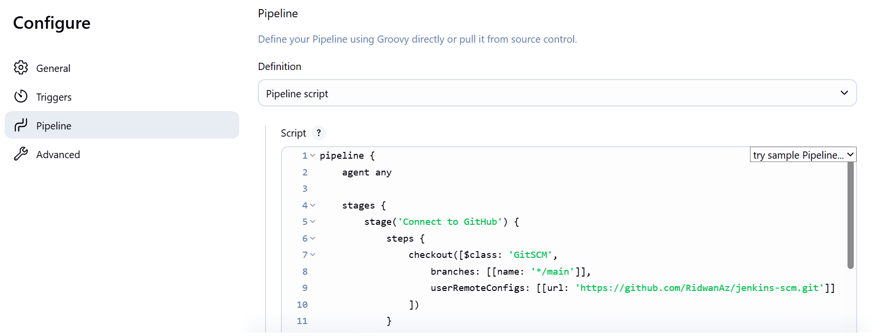

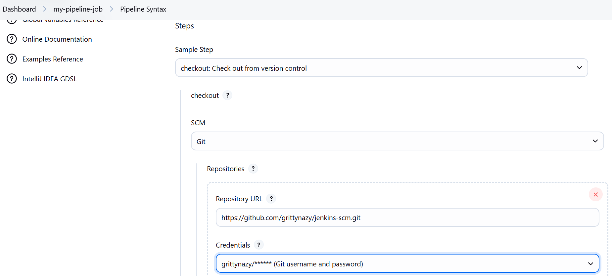

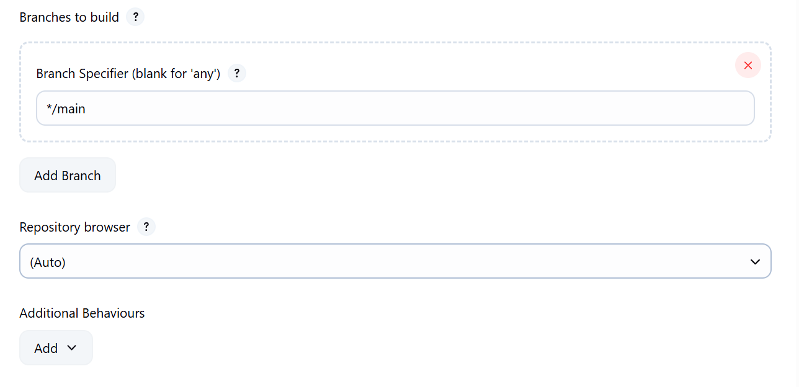

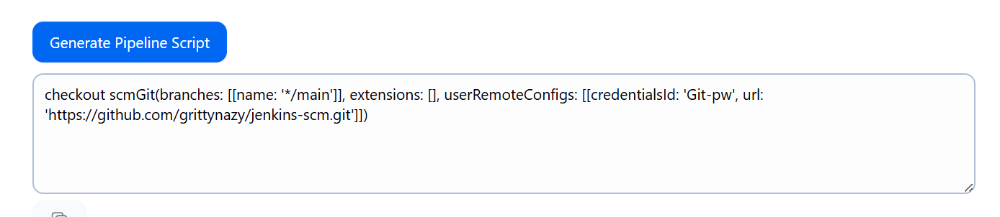

I created a github webhook to enable the jenkins pipeline seamlessly pull from Github
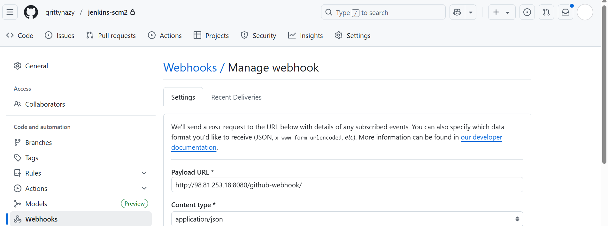

I confirmed that docker was installed and active on the same machine that is running jenkins
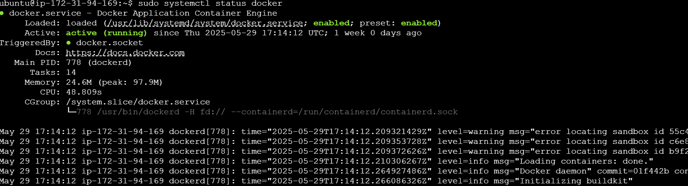

I created a dockerfile and index.html file and inputted the content of the both files
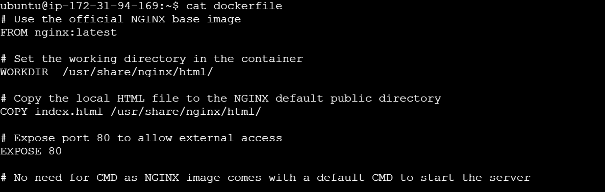

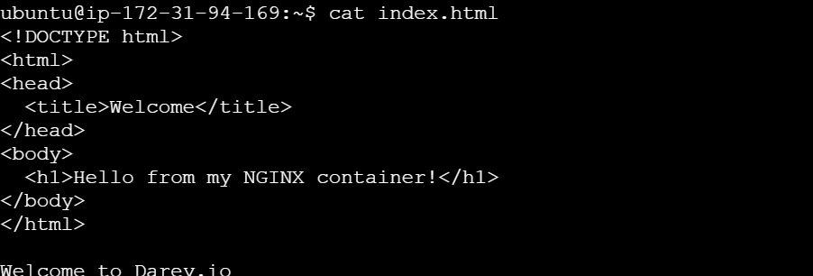

I adjusted my EC2 instance security group to allow traffic on port 8081 from anywhere
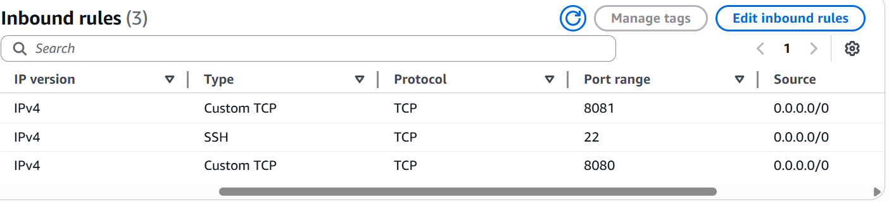

I then pushed a change to github
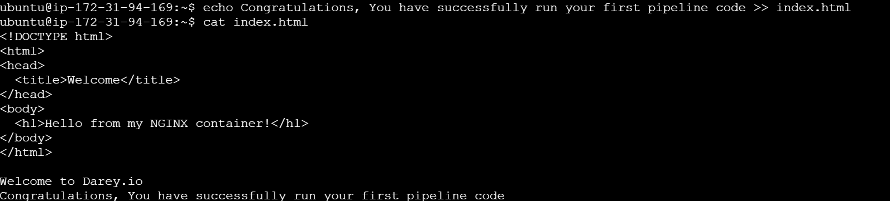
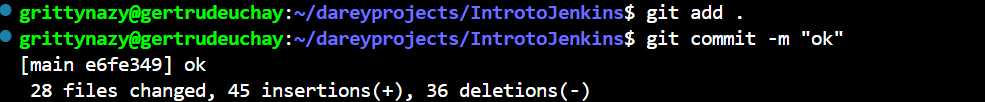
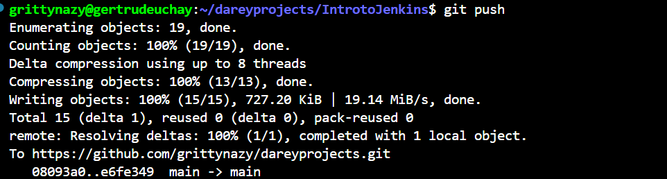

But the build was not successful
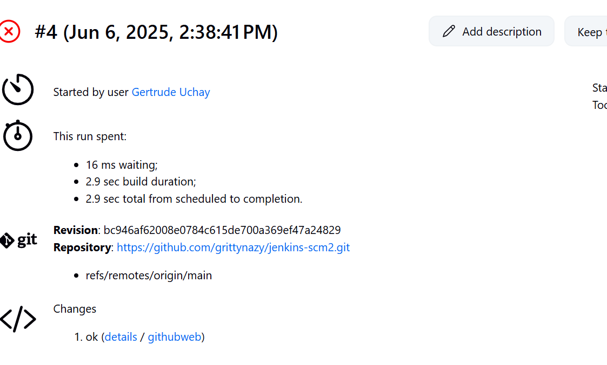

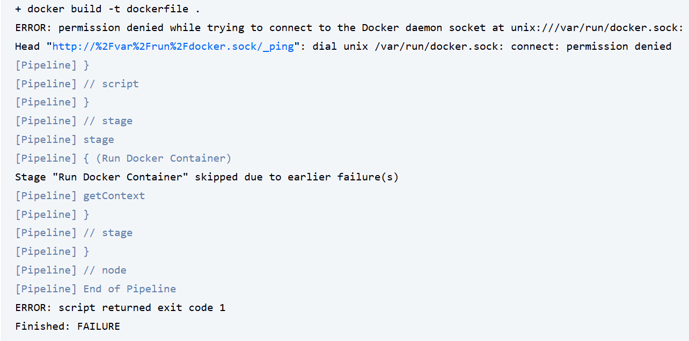

I then added jenkins to the docker group so it can have access and the build ran successfully

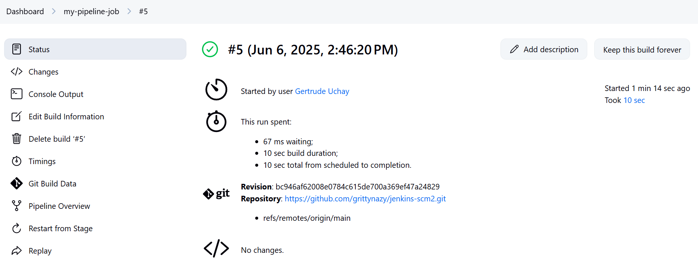

I was then able to access the nginx container on my web server
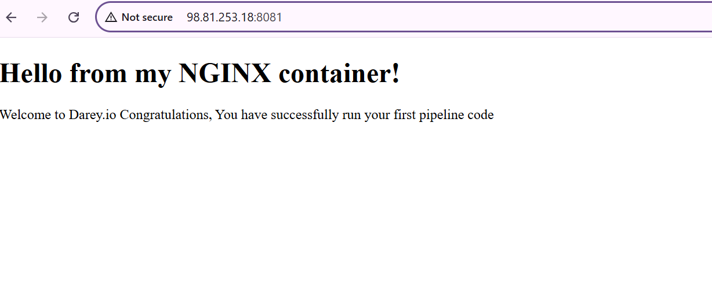