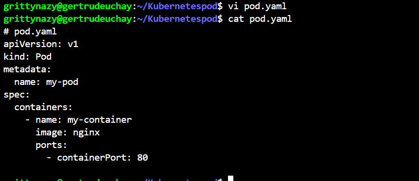
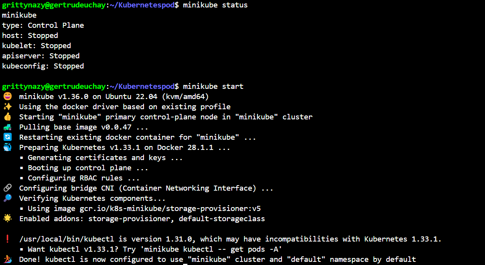
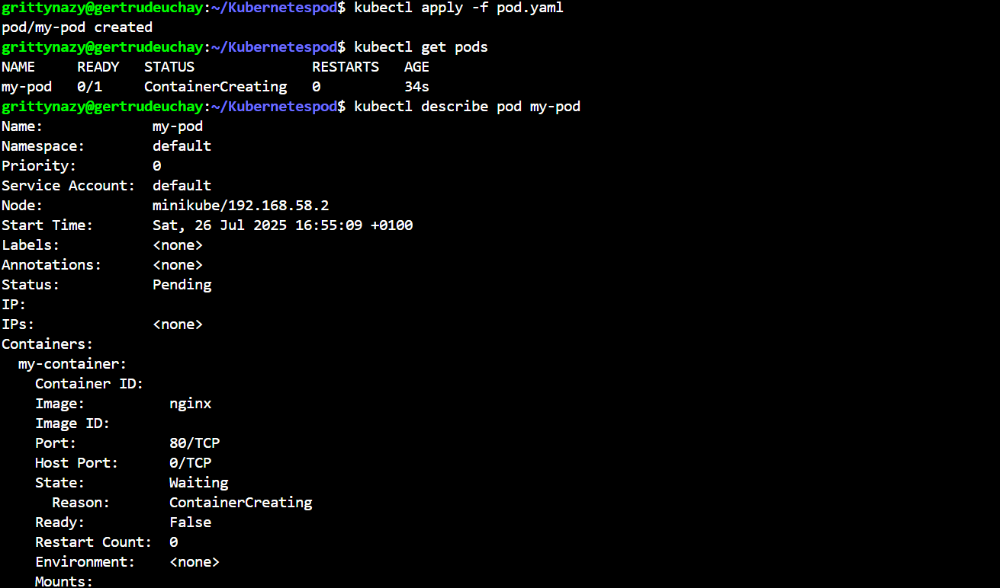
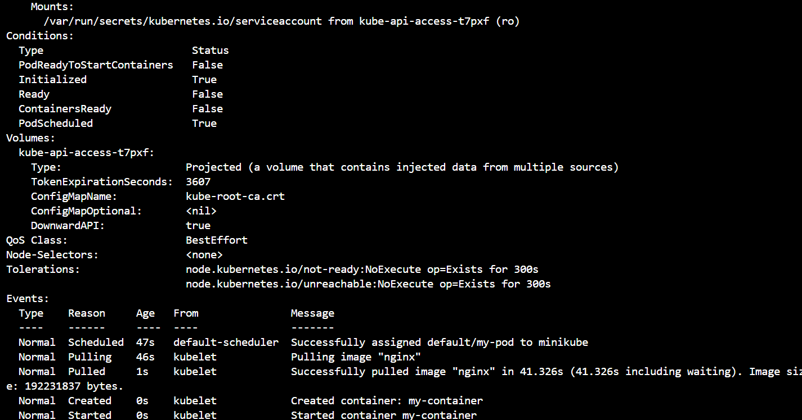
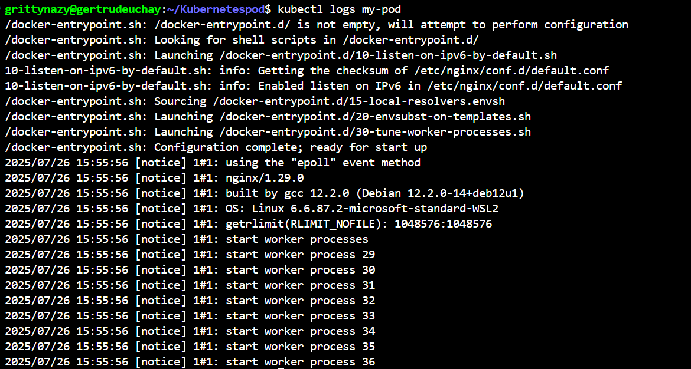
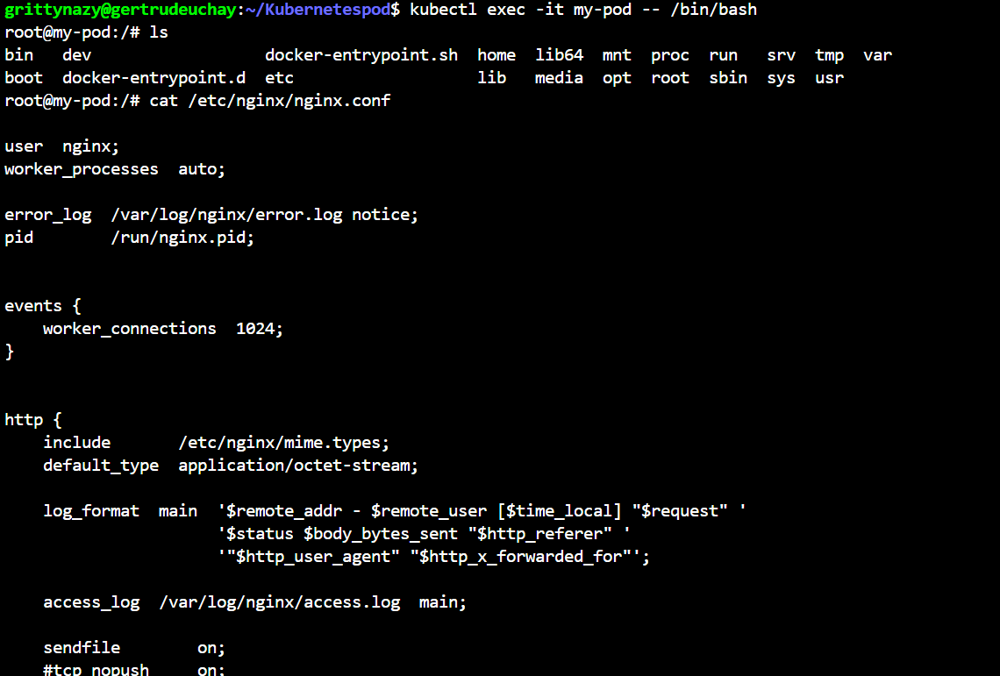
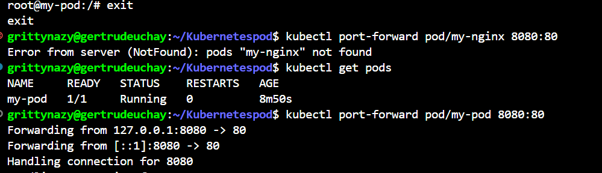
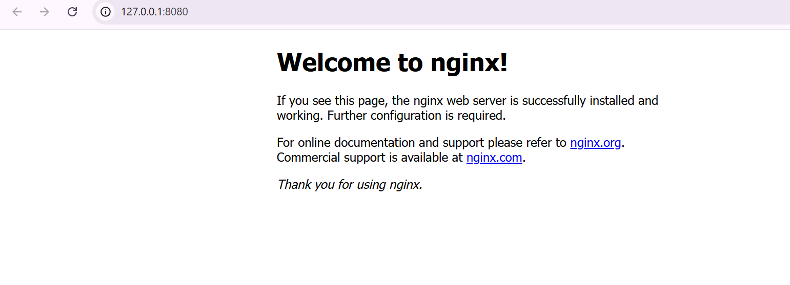
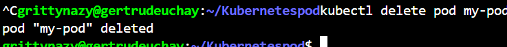

# WORKING WITH KUBERNETES PODS

In this project, I created a pod from a yaml file and applied it. I was able to view my pod, get detailed info about the pod, see logs from the container in a pod, execute commands within the pod, port forwarded to access the container from my local machine and finally deleted the pod

