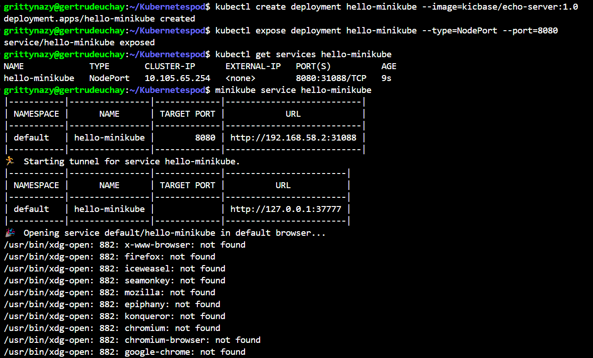
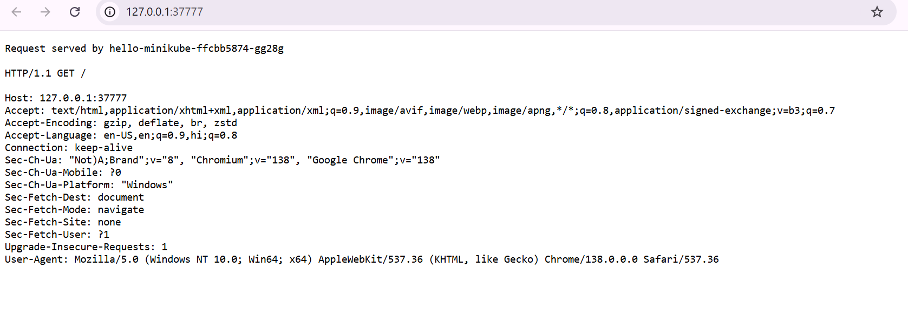
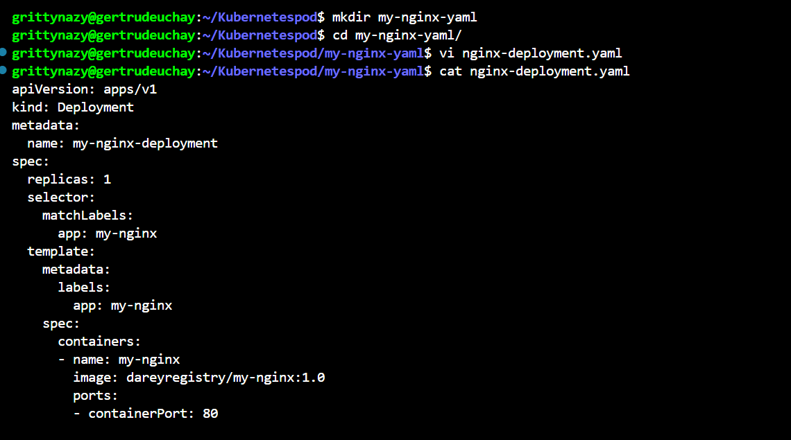
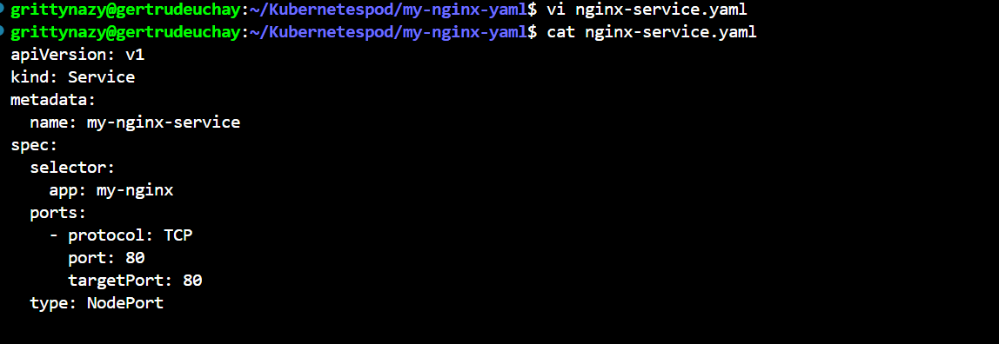
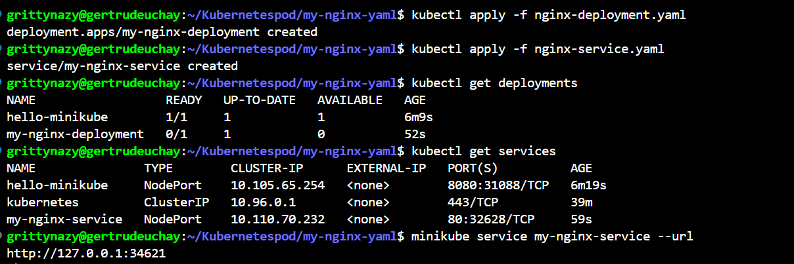
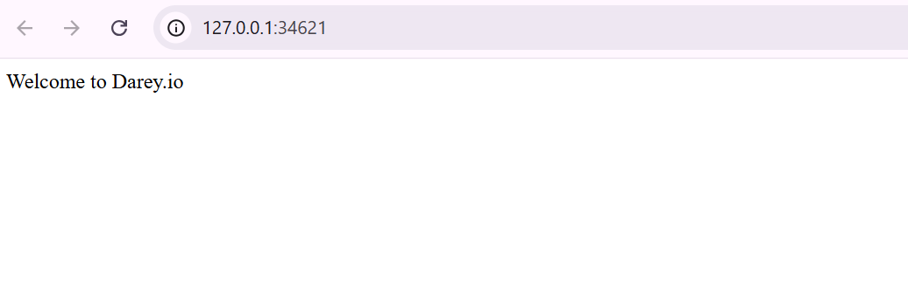

# WORKING WITH KUBERNETES RESOURCES

I created a minikube deployment and service with kubectl, exposed the kubernetes deployment named hello minikube as a NodePort service on port 8080 and then let minikube launch a web browser for me.

I then created a deployment yaml file and a service yaml file. I deployed the app on the cluster, verified the deployments and accessed my deployment on the web browser. 

