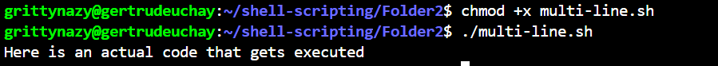

# LINUX SHELL SCRIPTING (COMMENTS)

I practiced single line commenting, commenting after a command and multiple single line commenting

## Single Line Commenting
I created the shell script and commented in it

I gave execute permissions and ran the script

I ran a script that prints a welcome message, create a directory, lists the files in the files in the current directory and displays a goodbye message

## Multiple Single Line Comments
I created the shell script and commented in it

I gave execute permissions and ran the script

