# LINUX SHELL SCRIPTING (CONTROL FLOWS)
 To demonstrate control flows, I ran a script which asks for a number and then tells us whether the number is positive, negative or zero

 I created a file and put the first line of script in it 
 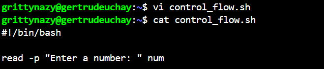

 I gave execute permissions and ran the script. The script asked me to enter a number and nothing else happened
 
 
 I then added a second line of script
 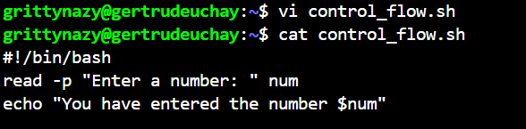
 I ran the script
 

 I then added the if statement to execute commands based on conditions
 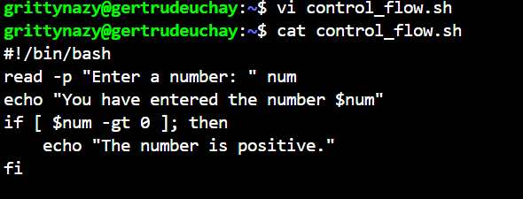
 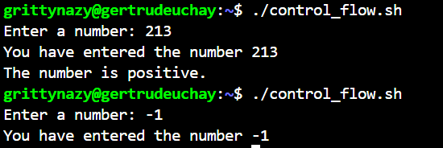

 I added the else if statement and input a negative number
 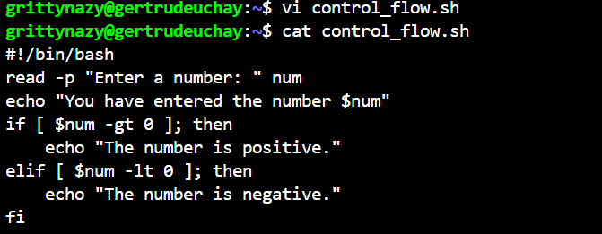
 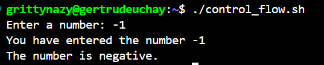

 ## LOOPS
 For loops, I practised the List form and the C-style loop
 In the list form , I practiced a basic and range syntax loop styles

 I create 2 scripts for each style of the List format and input the scripts

 Basic syntax
 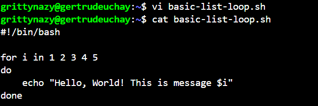
 

Range syntax
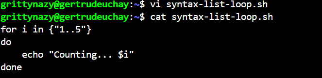
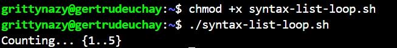

For the C loop, I also created a script
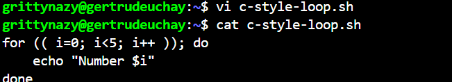
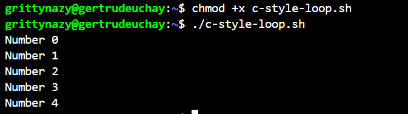

