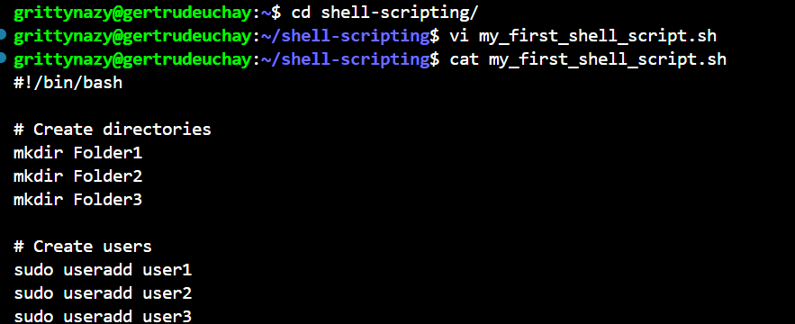
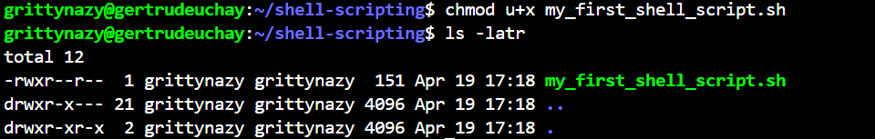
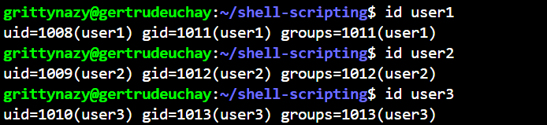
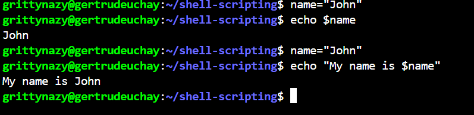

# LINUX SHELL SCRIPTING (MINI)
I practices some how to create a shell script, give execute permissions and run the script on the terminal.

First, I created a folder, entered into it and wrote a script to create some folders and users

To confirm that the file indeed was created, I ran ls -latr command

I executed the file without giving the execute permissions and I got a permission error

I then assigned the execute permission to the user

Then I ran the script

I ensured the folders where created using the ls command and the users were created using the id command

## Variable Declaration and Initialization
I assigned a value to a variable and retrieved the value from the variable using the echo command
