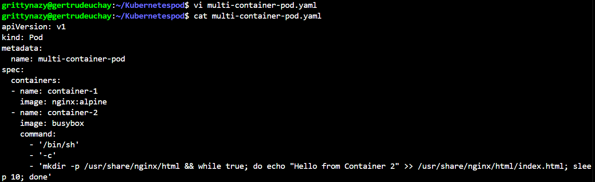
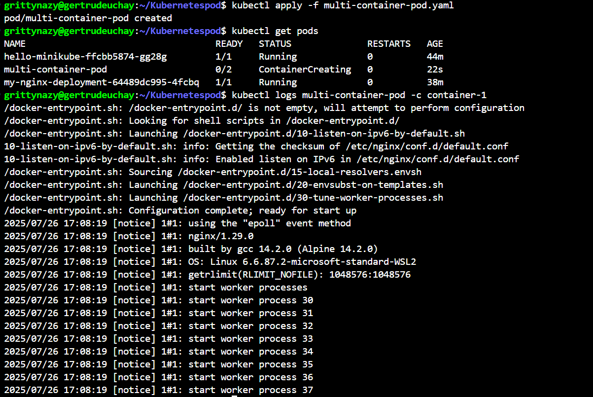
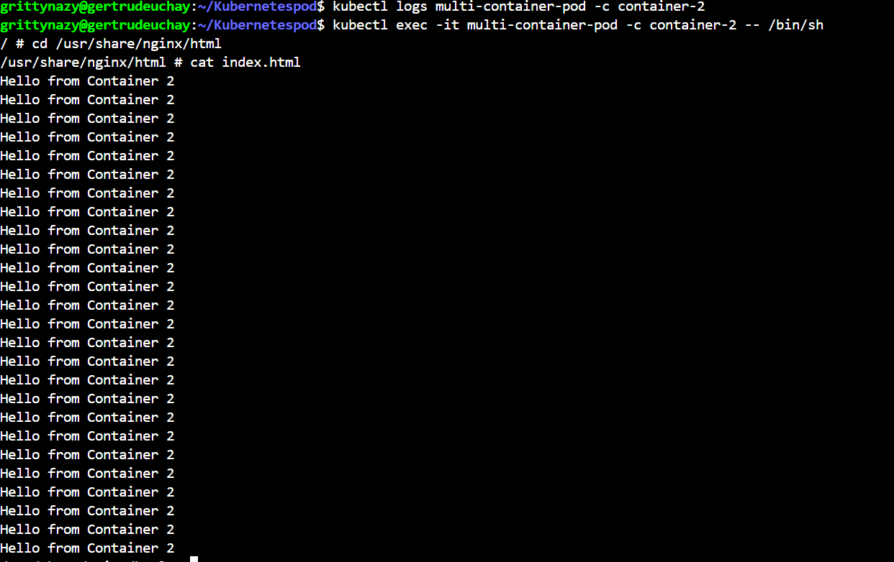
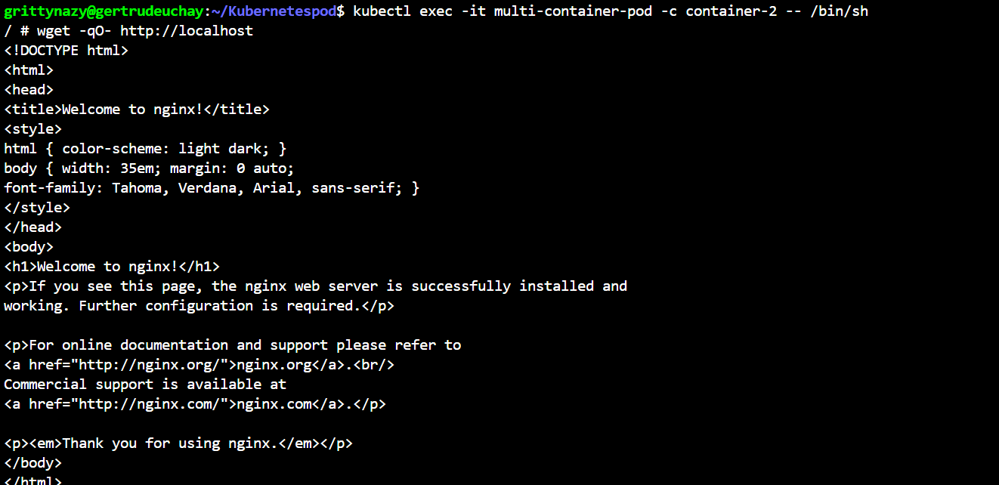

# NETWORKING IN KUBERNETES

In this project, I got my hands on pod networking in Kubernetes by deploying a pod with multiple containers, showcasing how they share the same network namespace and can communicate with each other.

Firstly, I created a multi container pod yaml file, applied the pod configuration and checked pod status and logs then I tried accessing nginx from BusyBox container using wget and it worked

