# Setting Up Minikube

Minikube is an open source tool that enables the running of Kubernestes clusters on locally on machines

### Installing minikube on Linux

I set up a linux server on AWS with 20gb disk storage, 2vcpu and 4gn RAM
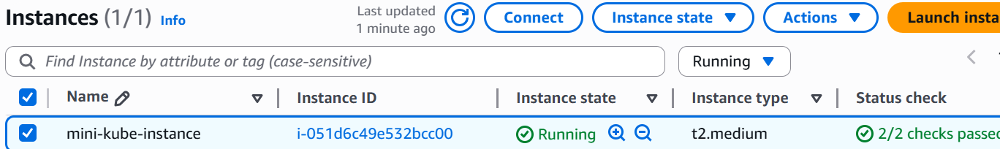
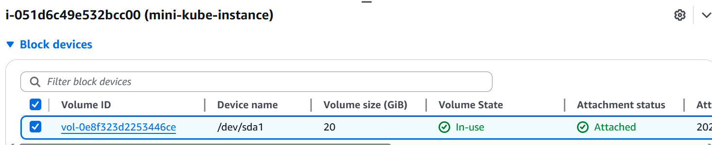

This is a linux command that refreshes the package list on a Debian-based system ensuring the latest software information is available for installation. 
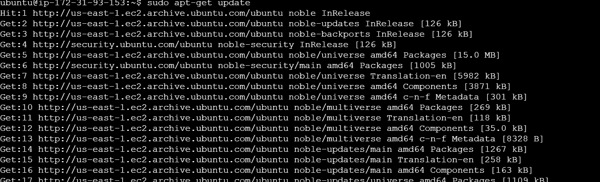

This is a linux command that installs essential packages including certificate authorities, curl and GNU Privacy Guard for secure communication and package verification

These commands create a directory with specific permissions for storing keyring files, which are used for docker's authentication, download the Docker GPG key using curl, sets read permissions for all users on the Docker GPG key file within the APT key ring directory and adds the repository to APT sources

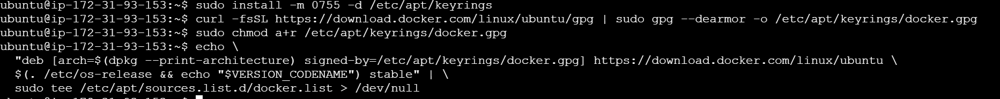

The following commands install latest version of docker and verifies that docker has been successfully installed
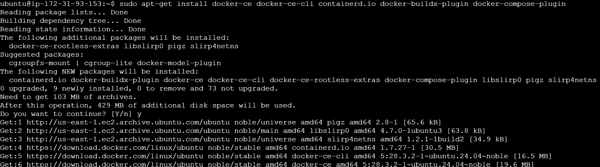

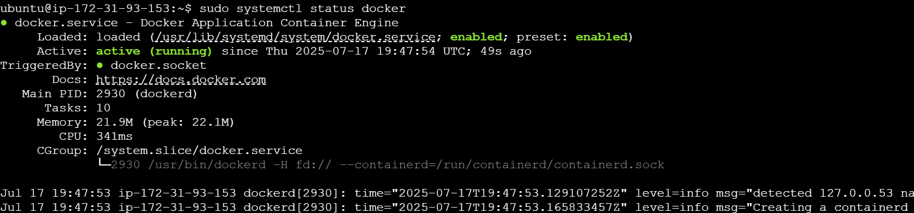

The following commands downloads minikube's binary and installs minikube using dpkg
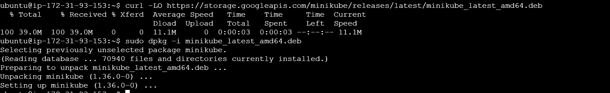

The following commands start minikube and downloads kubectl to interact with the kubernetes cluster

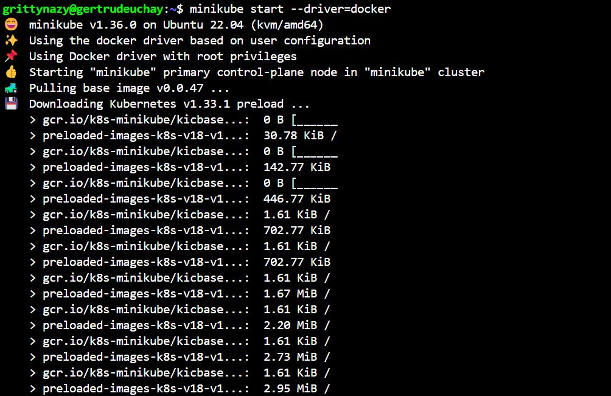
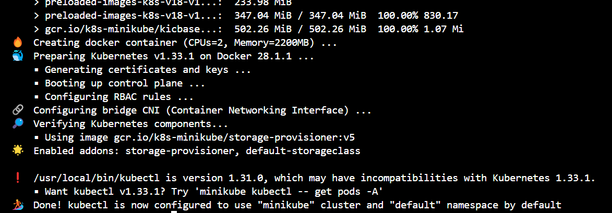

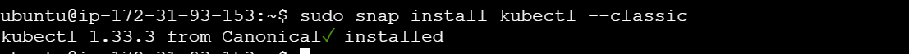

I tried to interact with cluster using kubectl
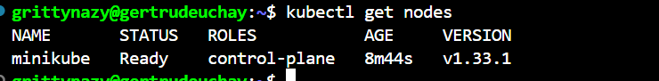

I ran the minikube dashboard command. The minikube dashboard is a command that opens a web-based Kubernetes dashboard for a local Kubernetes cluster running via Minikube.

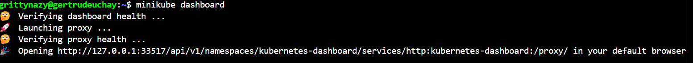

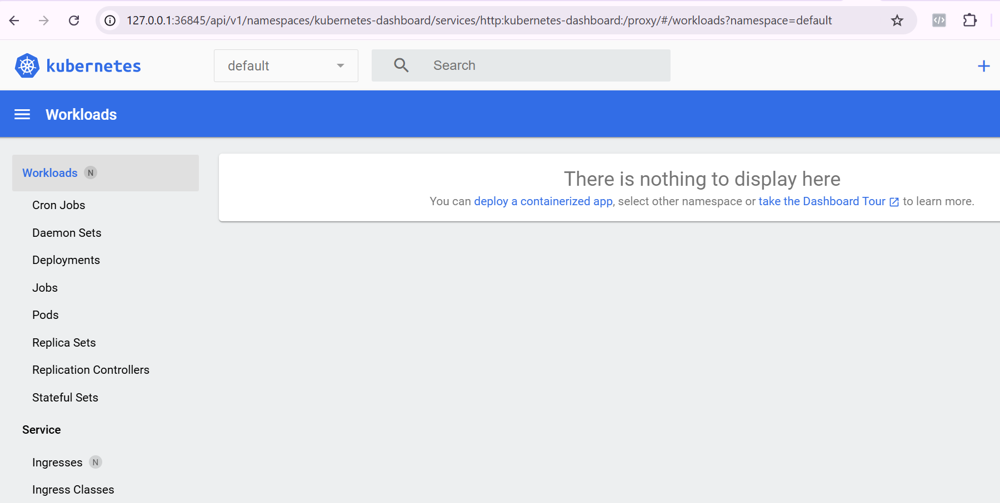

## Working With Kubernetes Nodes
I ran minikube start and it completed successfully. This implies I have just launched a single-node Kubernetes cluster locally. I then verified the cluster is running
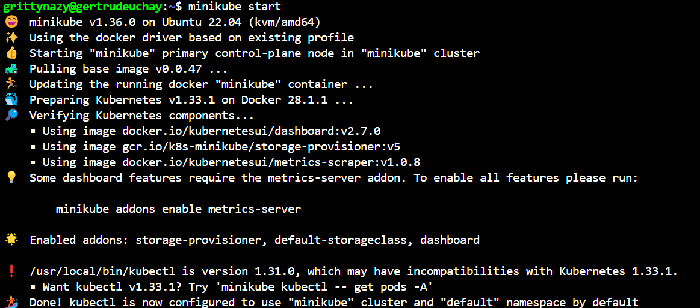

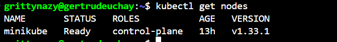

I then created a simple kubernetes deployment, exposed it and viewed it in my browser
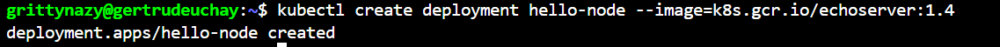

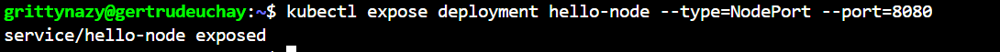

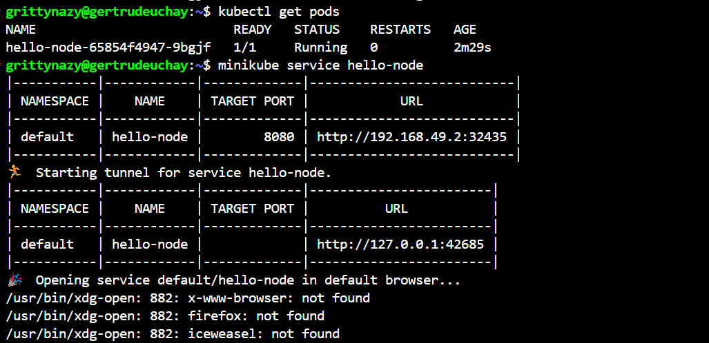

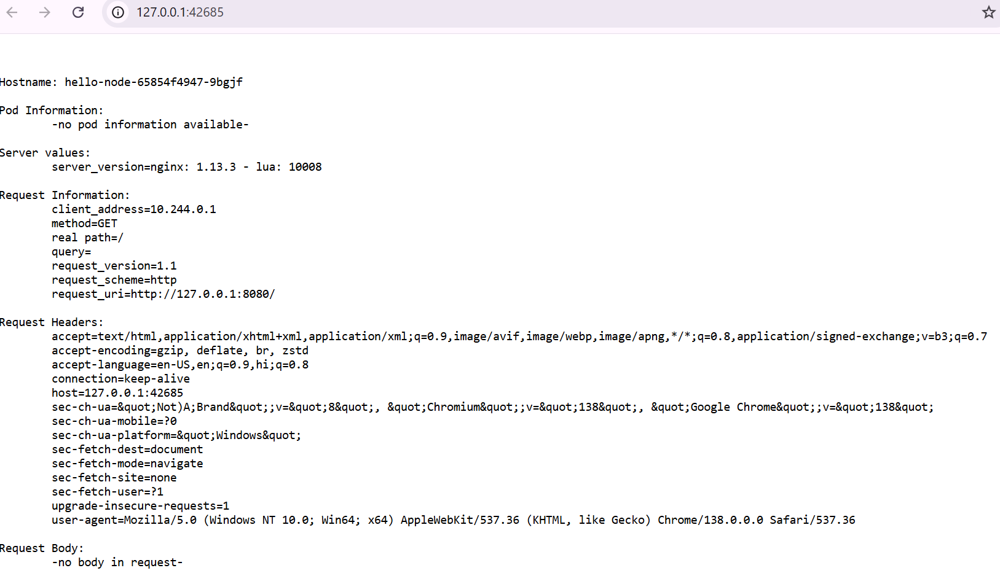

I checked the logs to verify that everything was working fine
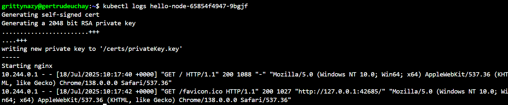

I then scaled the deployment to 3 replicas and confirmed that the number of pods had increased to 3
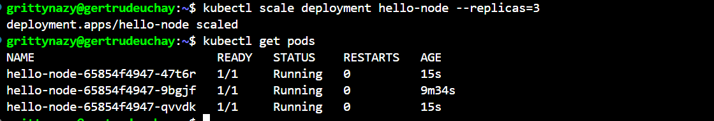

I then stopped the running minikube preserving the cluster state and deleted the minikube kubernetes cluster and its associated resources
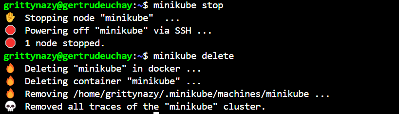