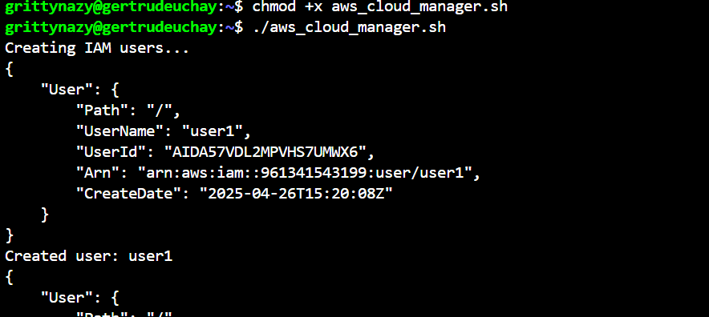

# SHELL SCRIPT FOR AWS IAM

I wrote a shell script for AWS IAM management
Firstly, I defined IAM User Names Array: The script stored the names of the 5 IAM users in an array for easy iteration during user creation

Secondly, I created IAM Users: The script iterates through the IAM user names array and creates IAM users for each employee using AWS CLI commands

Thirdly, I created an IAM Group: The script defines a function to create an IAM group named "admin" using the AWS CLI

Fourthly, I attached Administrative Policy to Group: Attach Administrator Access policy to the admin group to grant administrative privileges

Fifthly, I assigned Users to the Group: The script iterates through the array of IAM usernames and assigns each user to the admin group, using AWS CLI commands

This is the script below
#!/bin/bash

# Define IAM User Names Array
IAM_USERS=("user1" "user2" "user3" "user4" "user5")

# Create IAM Users
echo "Creating IAM users..."
for USER in "${IAM_USERS[@]}"; do
  aws iam create-user --user-name "$USER"
  echo "Created user: $USER"
done

# Create IAM Group
create_admin_group() {
  echo "Creating admin group..."
  aws iam create-group --group-name admin
  echo "Admin group created."
}

create_admin_group

# Attach Administrator Access Policy to Group
echo "Attaching AdministratorAccess policy to admin group..."
aws iam attach-group-policy --group-name admin --policy-arn arn:aws:iam::aws:policy/AdministratorAccess
echo "Policy attached."

# Assign Users to Group
echo "Adding users to admin group..."
for USER in "${IAM_USERS[@]}"; do
  aws iam add-user-to-group --group-name admin --user-name "$USER"
  echo "Added $USER to admin group."
done

echo "All tasks completed successfully."

Before, I ran the script I configured my terminal 

Then I created the script file and saved the script

Then I gave execute permissions

I then ran the script

On the AWS Management Console, I confirmed the creation of the 5 users, Admin group and the adding of the users to the admin group 

