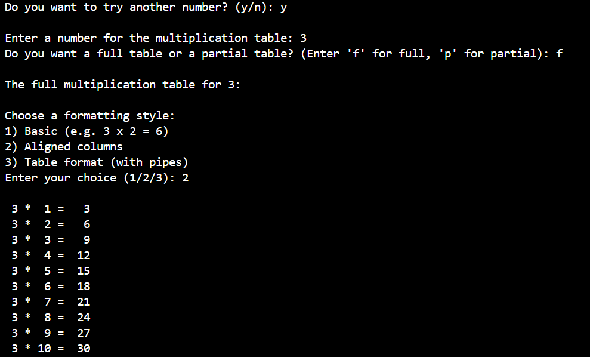

# SHELL SCRIPTING 
I created a file, put a bash script in it that

1. Accepts user input

2. Offers full or partial table

3. Validates ranges

4. Supports repeat without restarting

5. Provides formatting style options

## Multiplication Table Bash Script
I created a directory, gave it execution permissions and inserted the bash script below

Below is the bash script

#!/bin/bash

# Function to display multiplication table
display_table() {
    local num=$1
    local start=$2
    local end=$3
    local style=$4

    for ((i = start; i <= end; i++)); do
        case $style in
            1) echo "$num x $i = $((num * i))" ;;
            2) printf "%2d * %2d = %3d\n" "$num" "$i" "$((num * i))" ;;
            3) printf "| %-2d | %-2d | %-3d |\n" "$num" "$i" "$((num * i))" ;;
        esac
    done
}

while true; do
    echo
    read -p "Enter a number for the multiplication table: " num

    # Check if it's a valid number
    if ! [[ "$num" =~ ^[0-9]+$ ]]; then
        echo "Invalid input. Please enter a positive number."
        continue
    fi

    read -p "Do you want a full table or a partial table? (Enter 'f' for full, 'p' for partial): " choice

    if [[ $choice == "p" ]]; then
        read -p "Enter the starting number (between 1 and 10): " start
        read -p "Enter the ending number (between 1 and 10): " end

        if ! [[ "$start" =~ ^[0-9]+$ && "$end" =~ ^[0-9]+$ ]] || [ "$start" -lt 1 ] || [ "$end" -gt 10 ] || [ "$start" -gt "$end" ]; then
            echo -e "\nInvalid range. Showing full table instead."
            start=1
            end=10
        else
            echo -e "\nThe partial multiplication table for $num from $start to $end:"
        fi
    else
        echo -e "\nThe full multiplication table for $num:"
        start=1
        end=10
    fi

    echo -e "\nChoose a formatting style:"
    echo "1) Basic (e.g. 3 x 2 = 6)"
    echo "2) Aligned columns"
    echo "3) Table format (with pipes)"
    read -p "Enter your choice (1/2/3): " style

    if [[ ! "$style" =~ ^[1-3]$ ]]; then
        echo "Invalid formatting option. Using basic style."
        style=1
    fi

    echo
    display_table "$num" "$start" "$end" "$style"

    echo
    read -p "Do you want to try another number? (y/n): " again
    if [[ $again != "y" && $again != "Y" ]]; then
        echo "Goodbye!"
        break
    fi
done

This is the output for a full table using Table format formatting style

This is the output for a full table using Aligned columns formatting style

This is the output for a partial table using basic formatting style

This is the output of the goodbye message that ends the script
