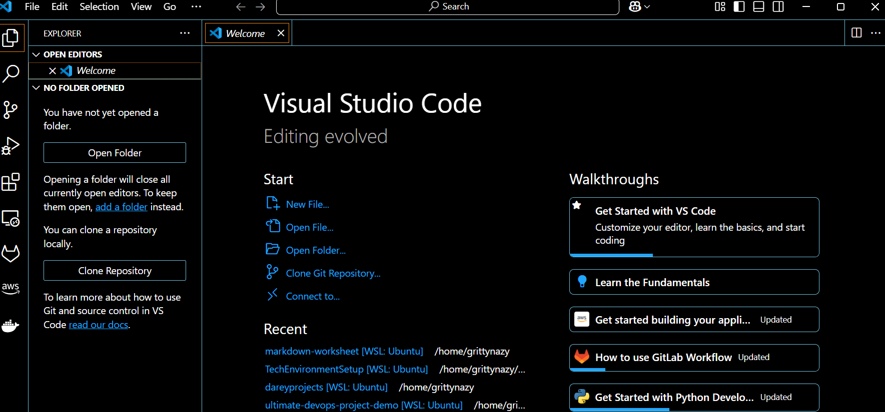
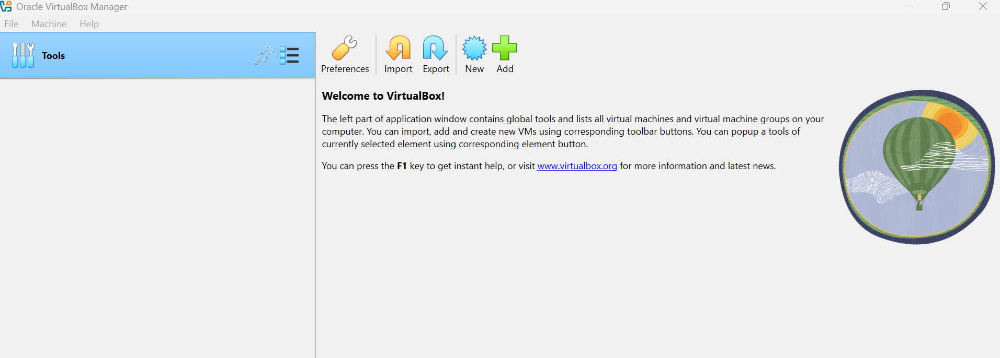
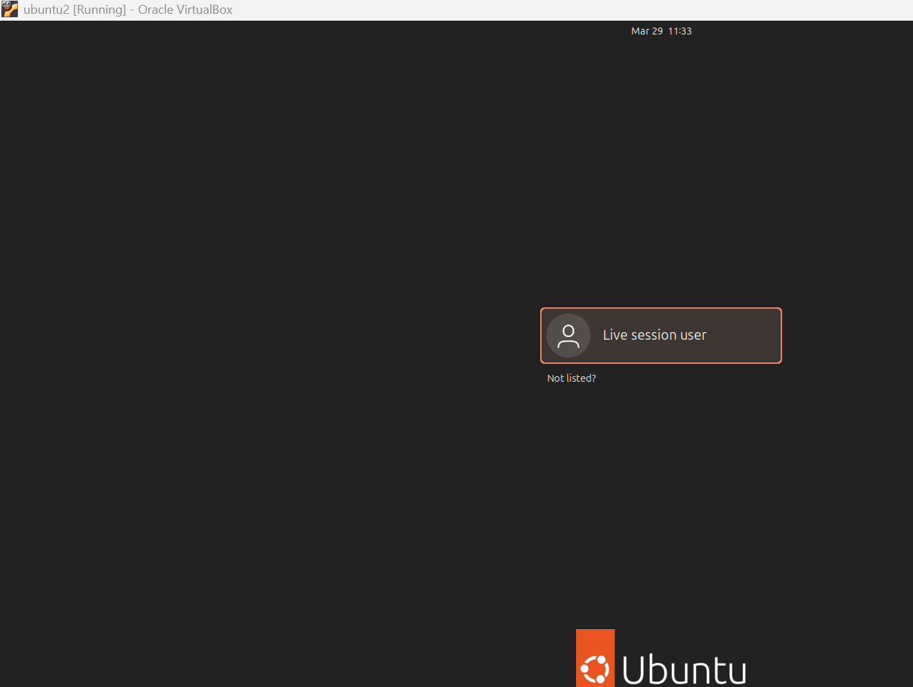
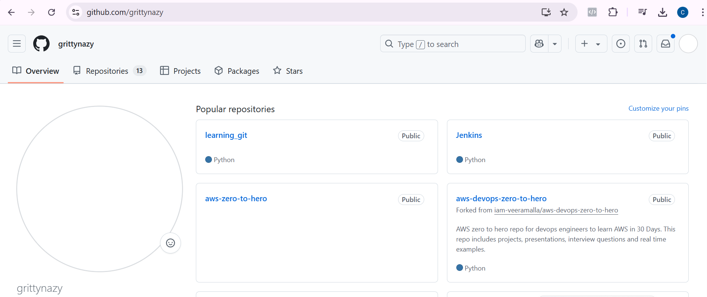
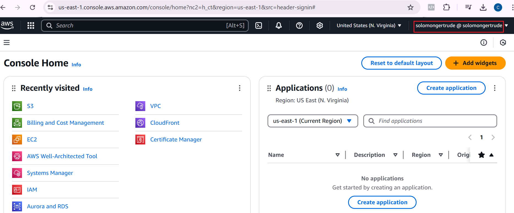

# Tech Environment Setup

In this project, I'll be installing some basic tools and creating some required accounts

## Visual Studio Code

I downloaded and installed Visual Studio Code on my Windows machine

## Git

I downloaded and installed git on my Windows machine. To verify git installation, I entered the following command `git --version` 

## Virtual box

I installed Virtual box on Windows and the screenshot below is the welcome page

## Ubuntu on Virtual box

I downloaded Ubuntu 24.04 OS and installed it on a virtual machine in Virtual box and started the Virtual machine. 

## Github Account

I created a github account using my email address

## AWS Account

I created a root user account on AWS and also created an IAM user and gave it administrative permissions

