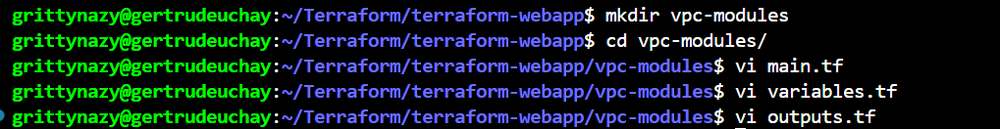
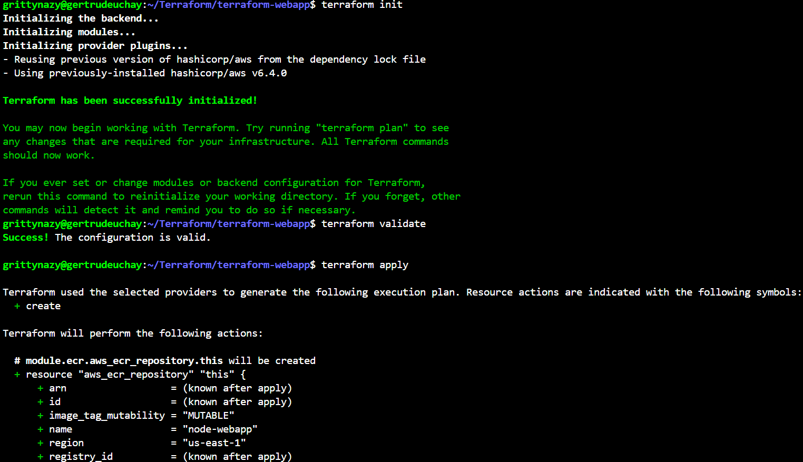
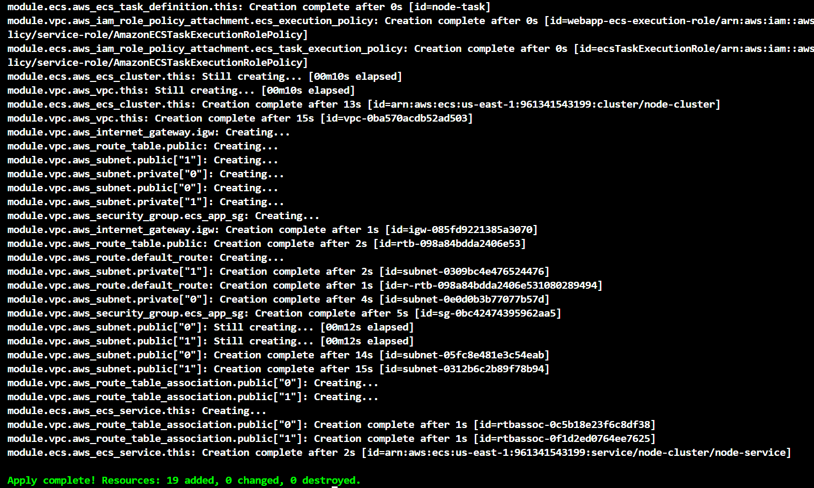
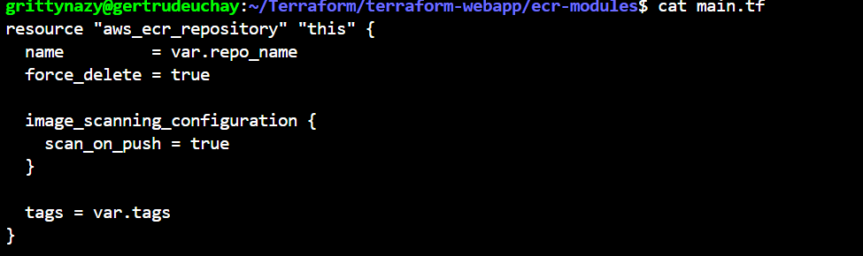

# Hosting a Dynamic Web App on AWS with Terraform Module, Docker, ECR and ECS

In this project, I used terraform to create a modular infrastructure for hosting a dynamic web application on ECS.The project involved containerizing the web app using Docker, pushing the DOcker image to Amazon ECR and deploying the app on ECS.

### Dockerization of Web App
I created a simple dynamic web app using Nodejs. I wrote a docker file to containerize the application and tested the Docker image locally to ensure the web app runs successfully within a container 

### Terraform Module for Amazon ECR

I created a new directory for the terraform project. Inside the project directory, I created a directory for the ECR module and wrote a terraorm module to create an ECR repository for storing Docker images.

### Terraform Module for ECS and VPC

I created directories for the ECS module and VPC module and wrote terraform modules to provision an ECS cluster, deploy the containerized web app, set up a vpc with subnets, security groups, route tables and internet gateway

### Main Terraform Configuration

I created the main terraform configuration files in the project directory and used the ECR and ECS modules to create the necessary infrastructire for hosting the web app

I then initialized the project, validated and applied the configuration

I then logged into docker, pushed the docker image I built earler to ECR using the ECR rpo URI I obtained via the outputs file. I confirmed the creation of all the resources via the console and I accessed my app via the ip address on port 3000

I then cleaned up and tore down all the resources by running terraform destroy but ran into an error

I then adjusted my ecr module to include force delete=true and ran terraform destroy again and all the resources got cleaned up

