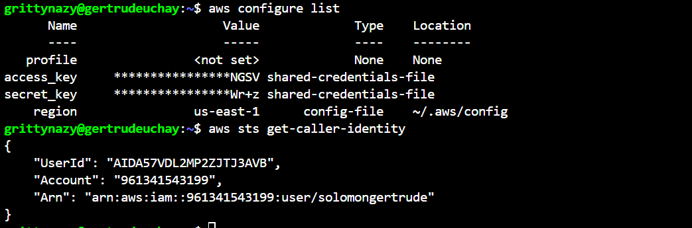

# TERRAFORM EC2 INSTANCE AND AMI CREATION

In this project, I used terraform to automate the creation of an EC2 instance on AWS and then created an AMI from that instance

Firstly, I confirmed the prerequisites which is to have aws installed, and configured. 

I checked my installed terraform and it was out of date, so i updated the packages on my machine and upgraded the terraform version

I made a directory for my terraform project and created a main.tf file. In this file I wrote a script to create an EC2 instance, specifying instance type, ami and tags. I extended this script to include the creation of an ami from the created ec2 instance

I initialized the terraform project using terraform init and I validated the correctness of this script using terraform validate but I ran into an error

The error came about because I used the resource aws_ami, which is used for registering an AMI manually, usually from an existing EBS snapshot, not from an EC2 instance. So I changed the resource from aws_ami to aws_ami_from_instance

I then ran terraform validate again and it worked fine

I confirmed the resources that will be created by the execution of this script using terraform plan

I then applied the configuration using terraform apply and confirmed the setup on my ec2 console

Then I cleaned up all the resources created by the script

