# TERRAFORM EC2 INSTANCE WITH KEY PAIR AND USER DATA

In this project, I used terraform to automate the launch of an EC2 instance on AWS, which included the generation of a downloadable key pair for the instance and the execution of a user data script to install and configure Apache http server

I created a directory and wrote my terraform code in a main.tf file in the directory. This code was to create an ec2 instance, generate a new key pair and make it downloadable and also allow incoming traffic on port 80

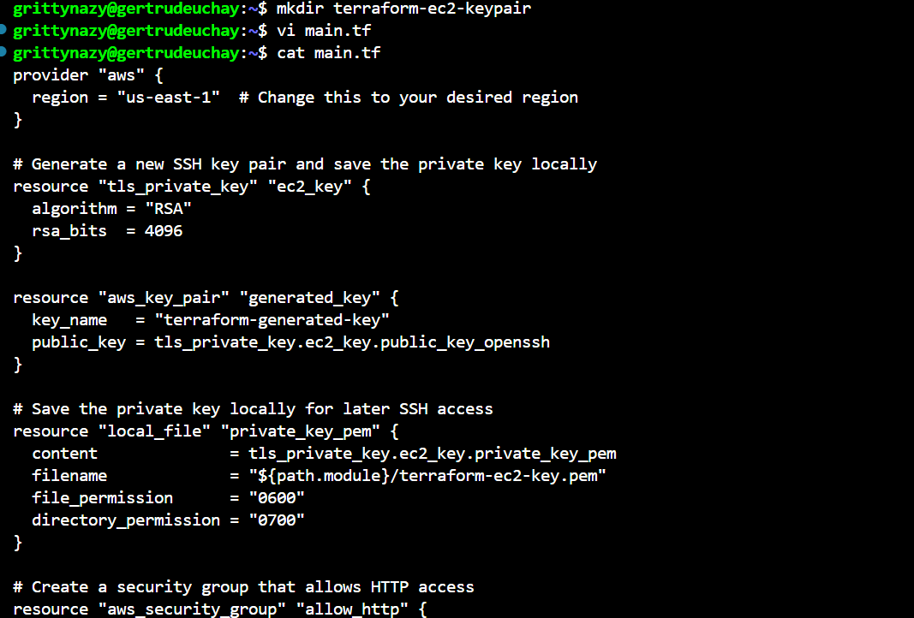
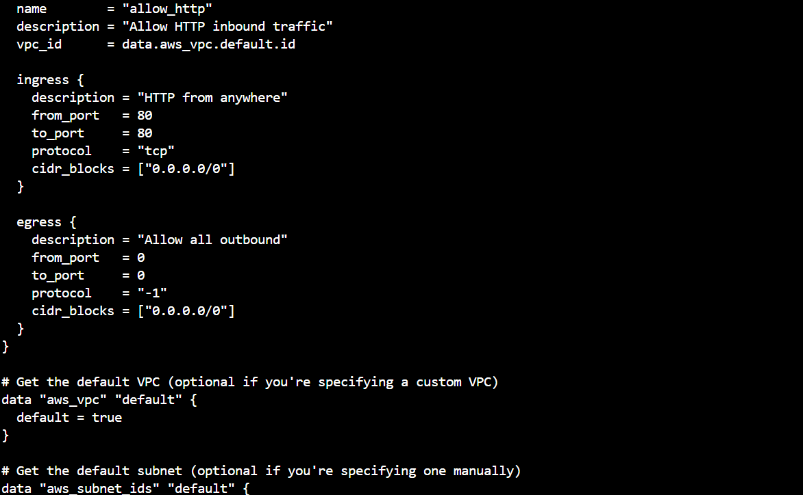
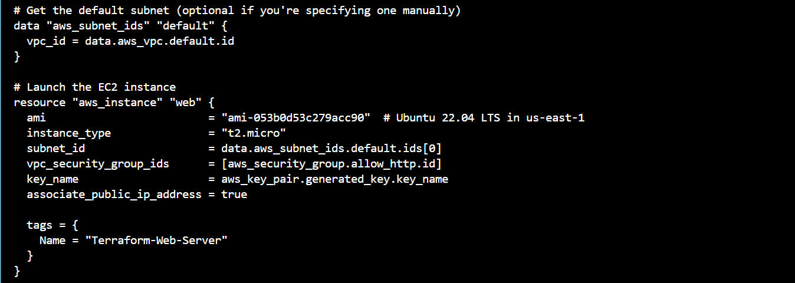

I initialized the terraform project, validated it and applied it
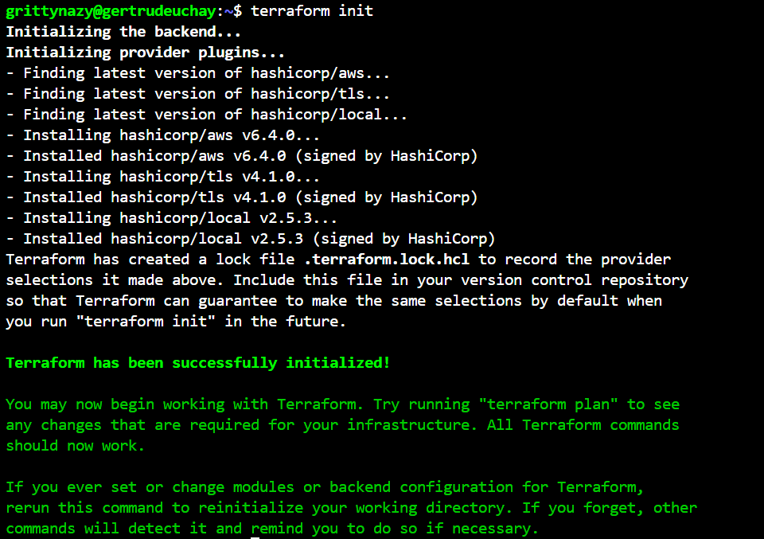

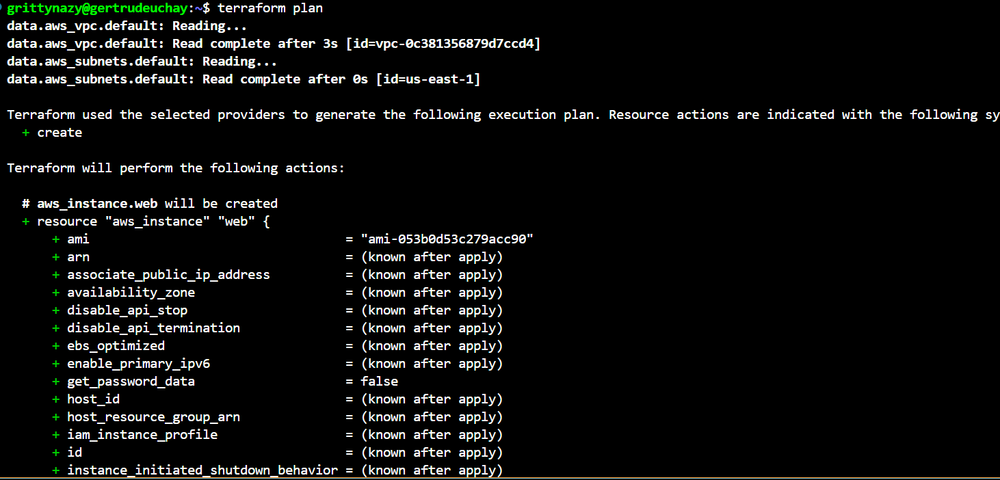
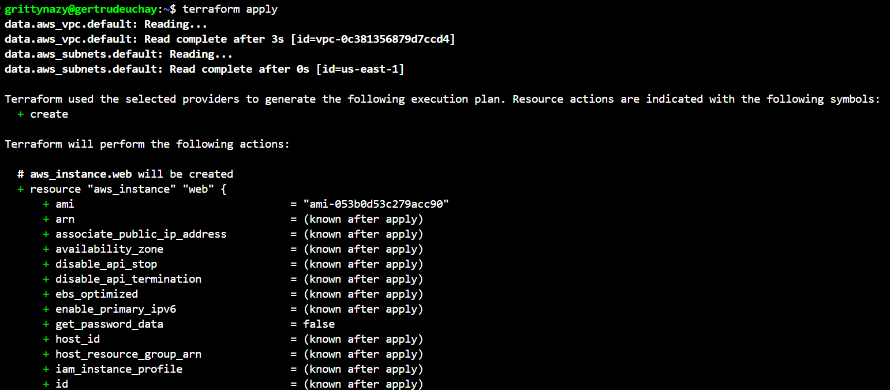
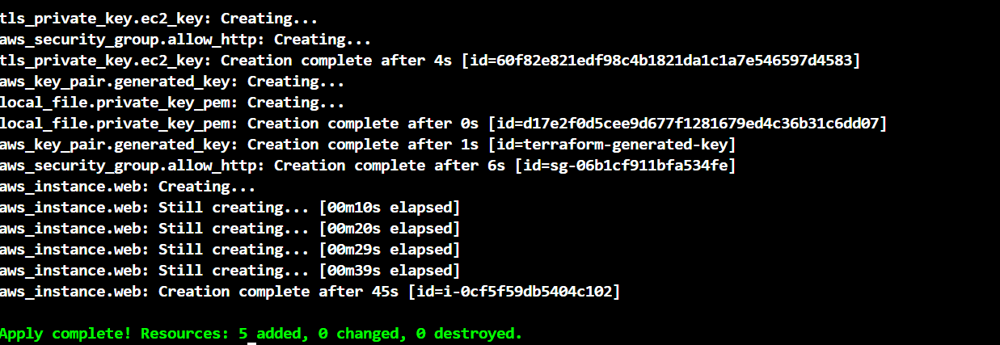

I then confirmed the creation of the resources from my AWS console
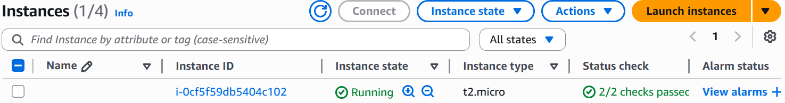
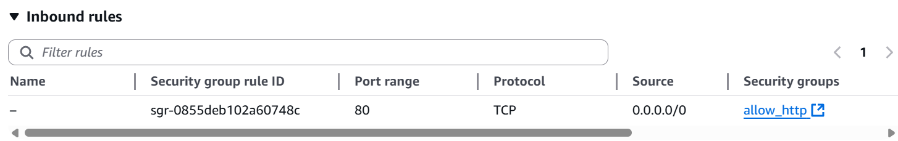

I extended the terraform configuration to include the script 
terraform {
  required_providers {
    aws = {
      source  = "hashicorp/aws"
      version = "~> 6.0"
    }
    tls = {
      source  = "hashicorp/tls"
      version = "~> 4.0"
    }
    local = {
      source  = "hashicorp/local"
      version = "~> 2.0"
    }
  }
}

provider "aws" {
  region = "us-east-1"
}

# 🔐 Generate a new SSH key pair
resource "tls_private_key" "ec2_key" {
  algorithm = "RSA"
  rsa_bits  = 4096
}

resource "aws_key_pair" "generated" {
  key_name   = "terraform-generated-key"
  public_key = tls_private_key.ec2_key.public_key_openssh
}

resource "local_file" "private_key" {
  content              = tls_private_key.ec2_key.private_key_pem
  filename             = "${path.module}/terraform-ec2-key.pem"
  file_permission      = "0600"
  directory_permission = "0700"
}

# 🔒 Create a Security Group allowing SSH and HTTP
data "aws_vpc" "default" {
  default = true
}

resource "aws_security_group" "web_sg" {
  name        = "terraform-web-sg"
  description = "Allow HTTP and SSH"
  vpc_id      = data.aws_vpc.default.id

  ingress {
    from_port   = 22
    to_port     = 22
    protocol    = "tcp"
    cidr_blocks = ["0.0.0.0/0"]
  }

  ingress {
    from_port   = 80
    to_port     = 80
    protocol    = "tcp"
    cidr_blocks = ["0.0.0.0/0"]
  }

  egress {
    from_port   = 0
    to_port     = 0
    protocol    = "-1"
    cidr_blocks = ["0.0.0.0/0"]
  }
}

# 🖥️ Launch EC2 instance with Apache installed
data "aws_subnets" "default" {
  filter {
    name   = "vpc-id"
    values = [data.aws_vpc.default.id]
  }
}

resource "aws_instance" "web_server" {
  ami                    = "ami-053b0d53c279acc90"  # Ubuntu 22.04 in us-east-1
  instance_type          = "t2.micro"
  key_name               = aws_key_pair.generated.key_name
  subnet_id              = data.aws_subnets.default.ids[0]
  vpc_security_group_ids = [aws_security_group.web_sg.id]
  associate_public_ip_address = true

  user_data = <<-EOF
              #!/bin/bash
              apt-get update -y
              apt-get install -y apache2
              systemctl start apache2
              systemctl enable apache2
              echo "<h1>Hello from Terraform EC2</h1>" > /var/www/html/index.html
              EOF

  tags = {
    Name = "Terraform-Web-Server"
  }
}

# 🌐 Output the instance public IP
output "ec2_public_ip" {
  description = "Public IP of the EC2 instance"
  value       = aws_instance.web_server.public_ip
}

I applied it and received the public ip as an output 
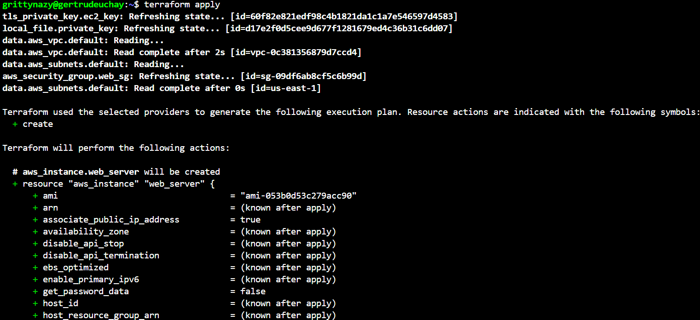
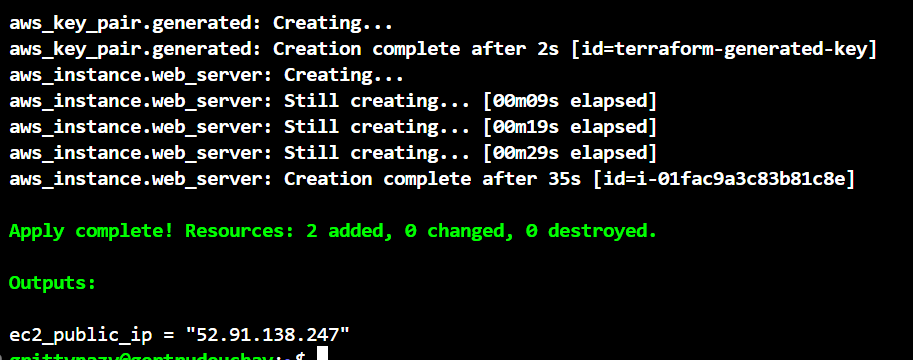

I then confirmed all the created resources on the AWS console
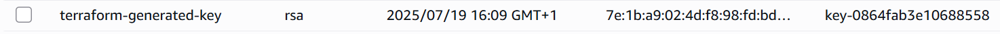

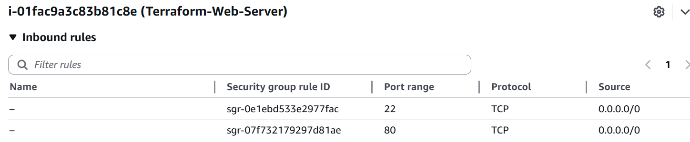
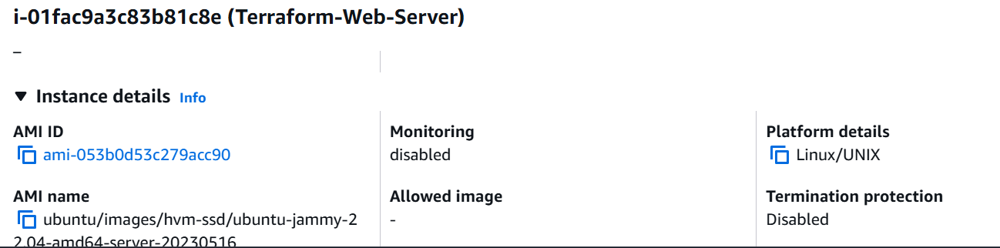
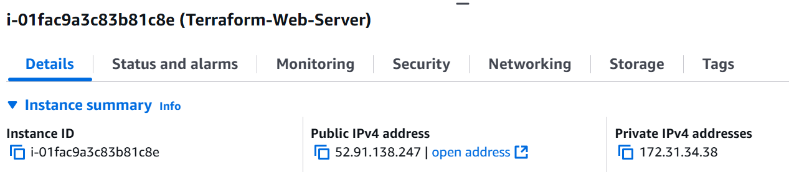

I was also able to access the web server and confirmed that it displays the message outlined in the user data script
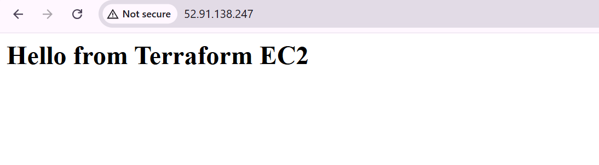