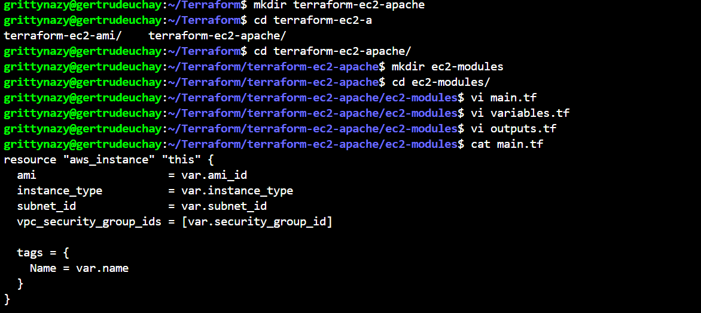
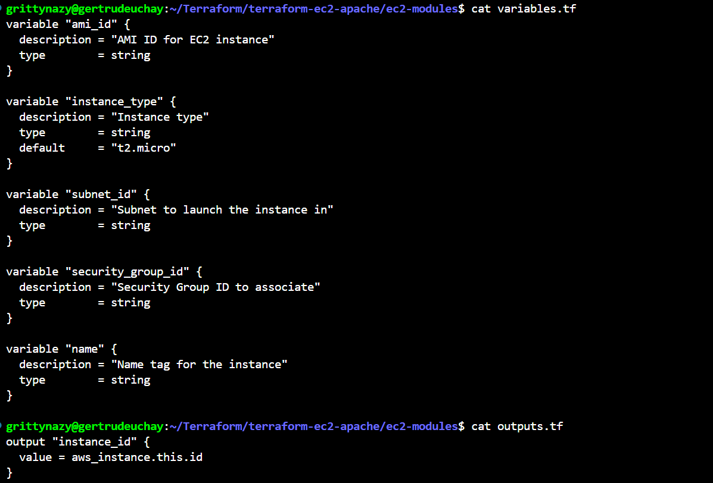
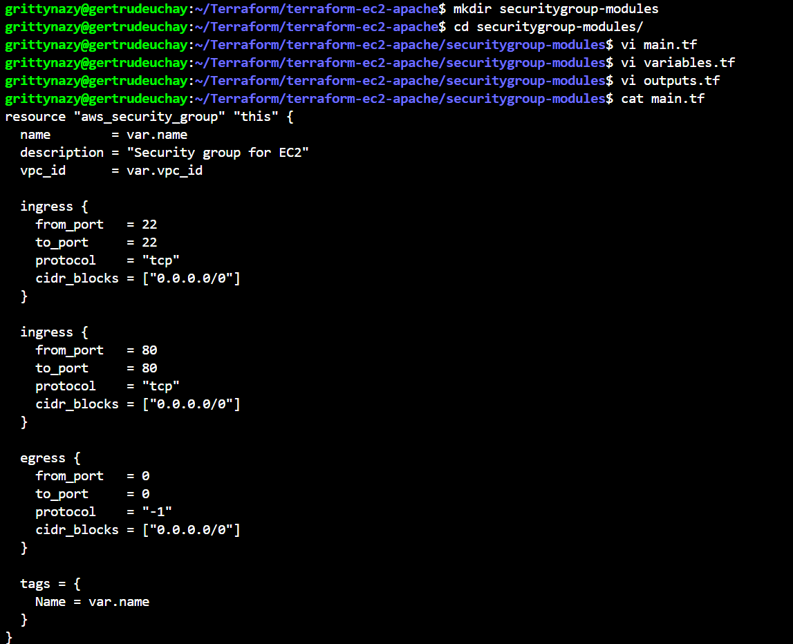
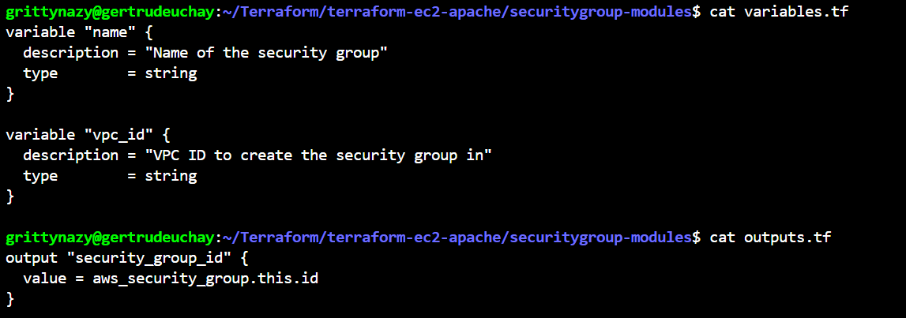
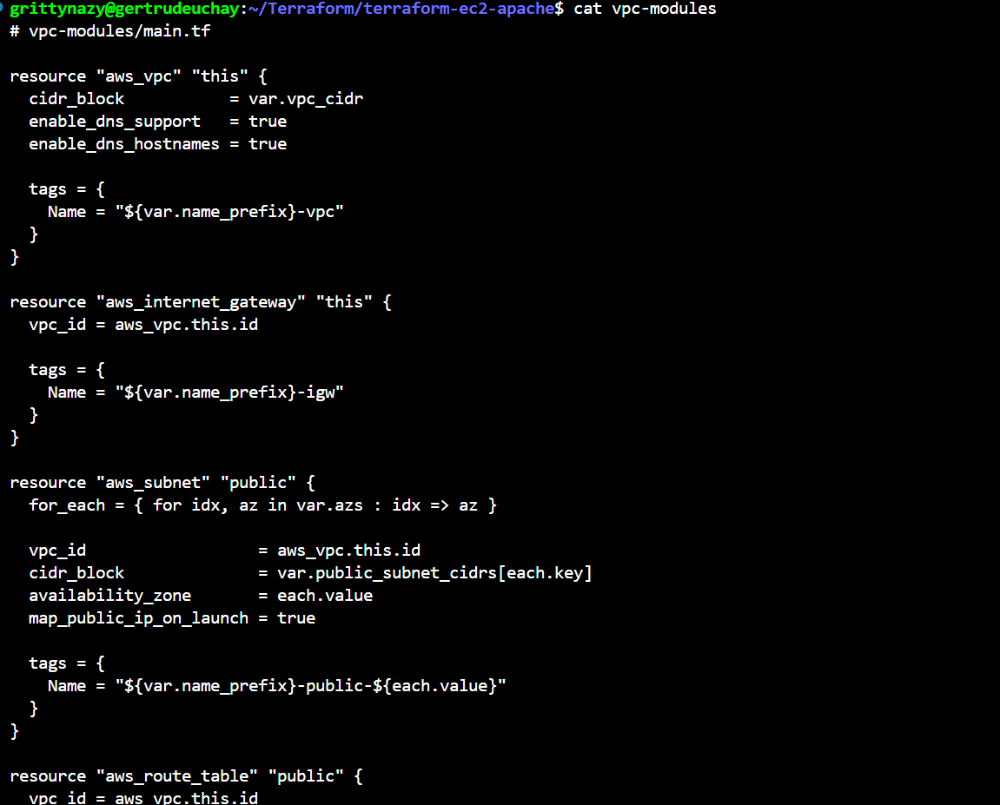
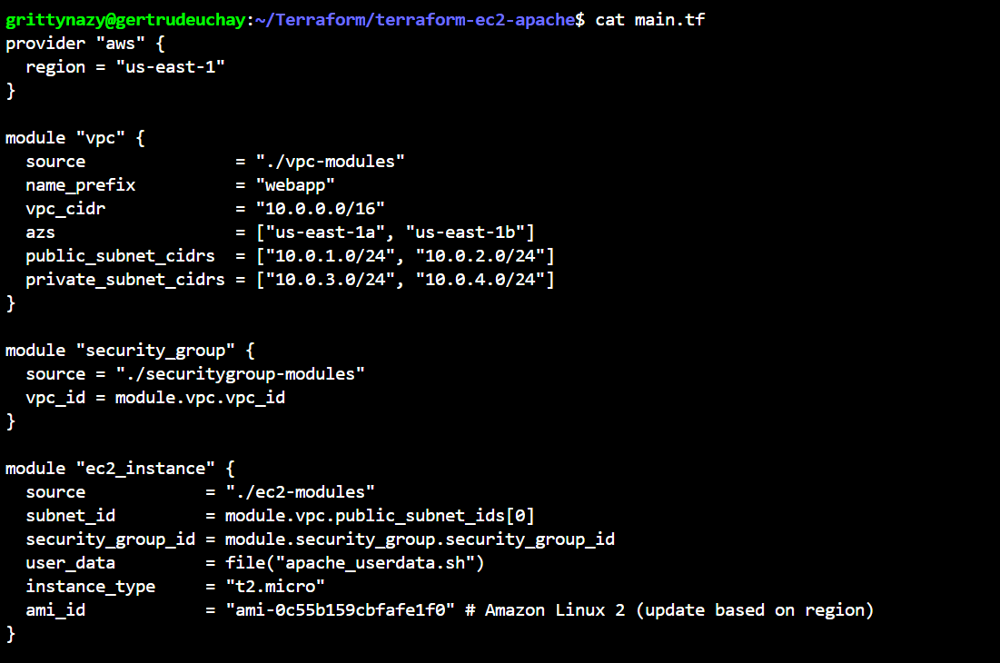
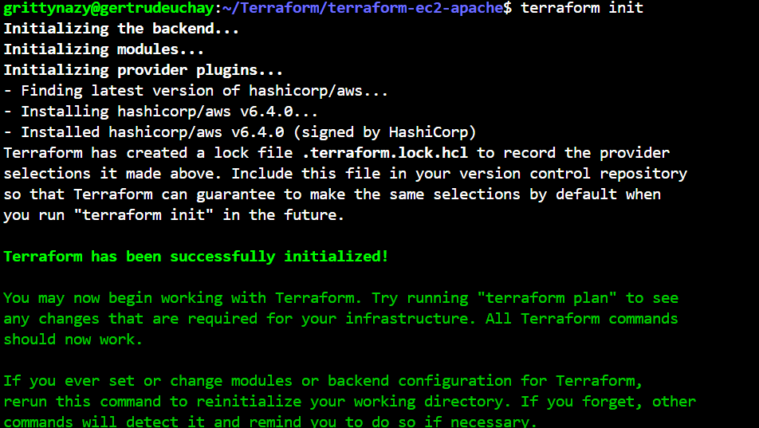
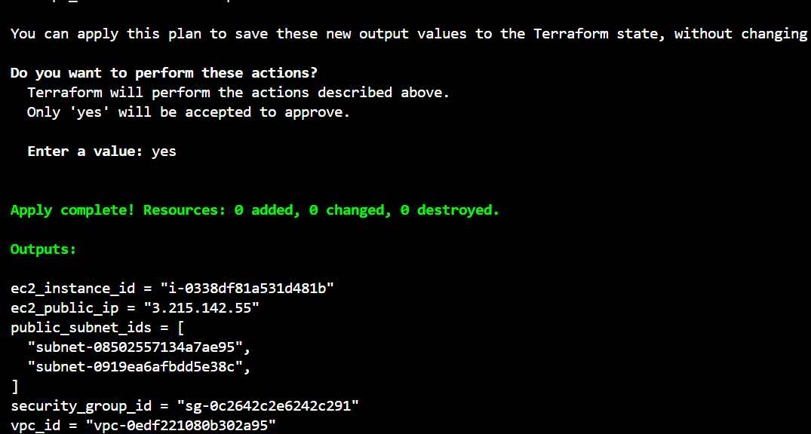
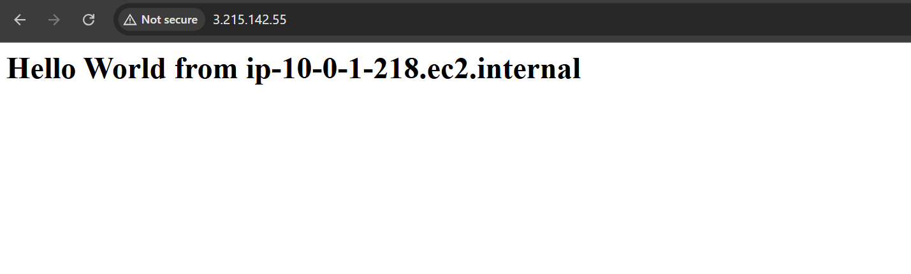
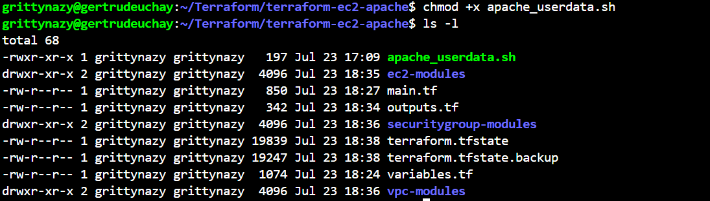

# EC2 Module and Security Group Module with Apache2 Userdata

In this project, I used terraform to create modularized configurations for deploying EC2 instance with a specified security group and apache2 installed using Userdata.

Firstly, I created a directory for my terraform project and inside it I created directories for EC2 module, Security group module and Vpc modules. Inside these modules, I wrote a terraform module to create an EC2 instance, create a security group for the instance and create a vpc respectively. I then wrote a user data script to install and configure apache2 on the EC2 instance and I ensured the userdata script is executable. I then created the main terraform configuration file and used the ec2, security group and vpc modules to create the necessary infrastructure fo the EC2 instance. With the output I got after running terraform apply, I retrieved the public ip and opened it in my browser to view the hello world page that was infused in my user data script.

