# TERRAFORM MODULES - VPC AND S3 BUCKET WITH BACKEND STORAGE

In this project, I used Terraform to create modularized configurations for building a VPC and an S3 bucket. I also configured terraform to use S3 as the backend storage for storing the terraform state file.

Firstly, I created the root directory then inside it, I created directories for the VPC and S3 modules. Each module had it's own main.tf, variables.tf and outputs.tf files. The root directory had the main terraform configuration files which use the VPC and S3 modules
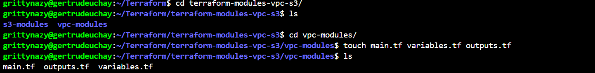

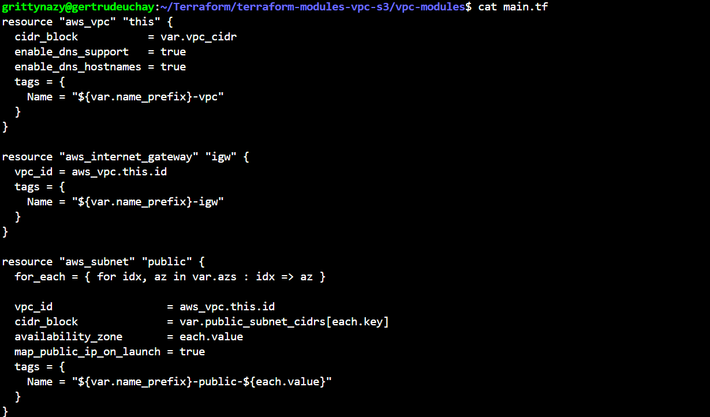

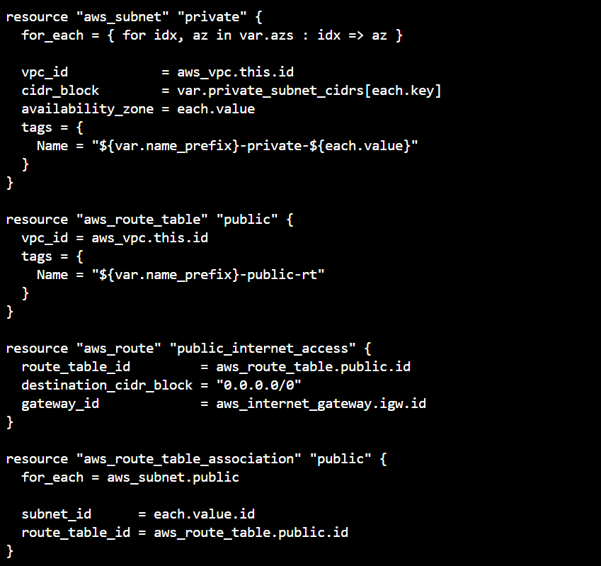

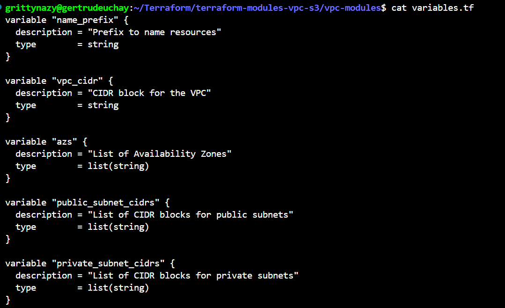

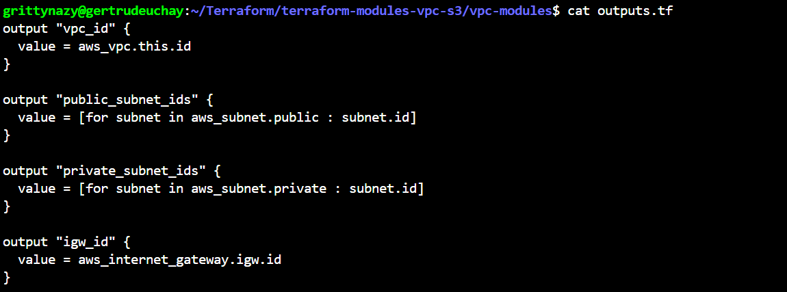

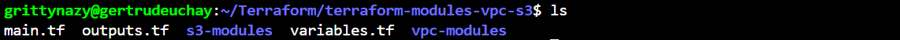

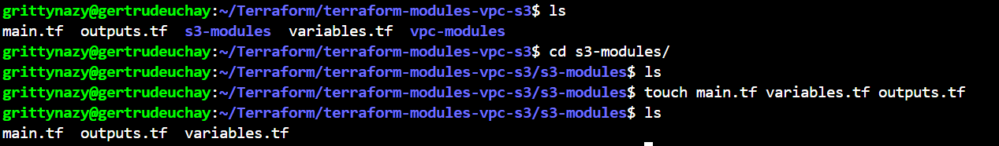

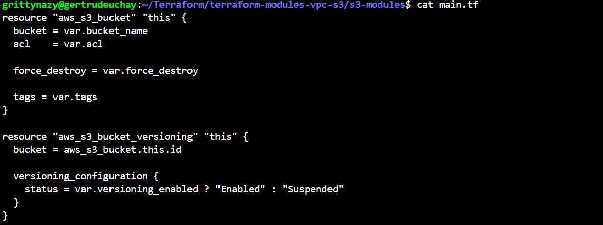

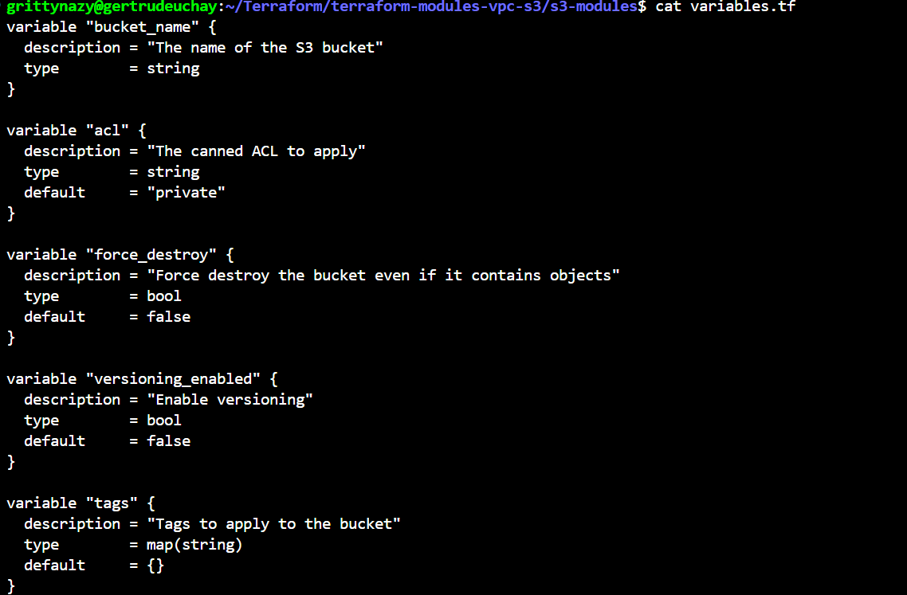

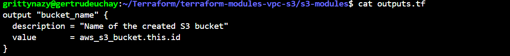

I configured terraform to use Amazon S3 as the backend storage for storing the terraform state file. I created a backend configuration file specifying the S3 bucket and key for storing the state.

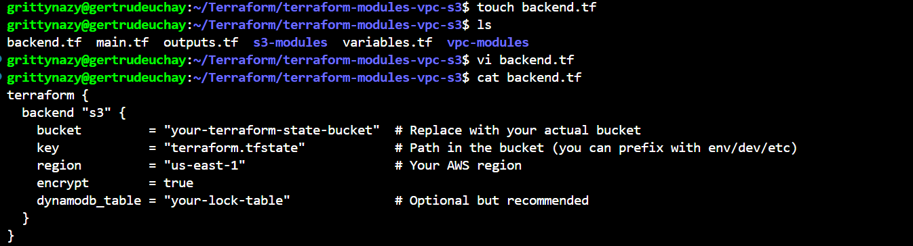

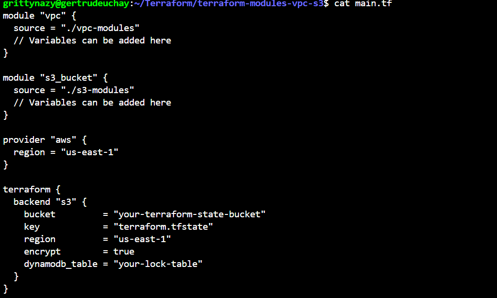

I manually created an S3 bucket for storing state files and a dynamo db table to implement state locking and consistency checking since I am using S3 as the remote backend
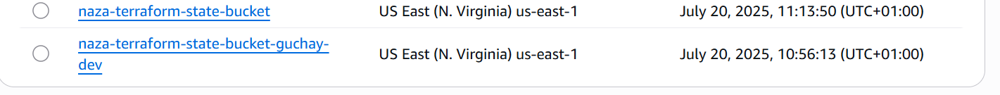

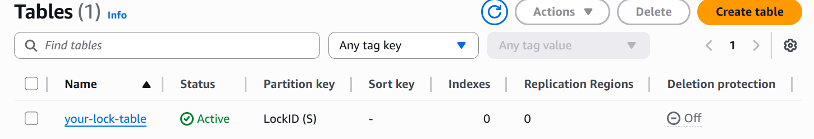

I then initialized the terraform configurations, validated it and applied it
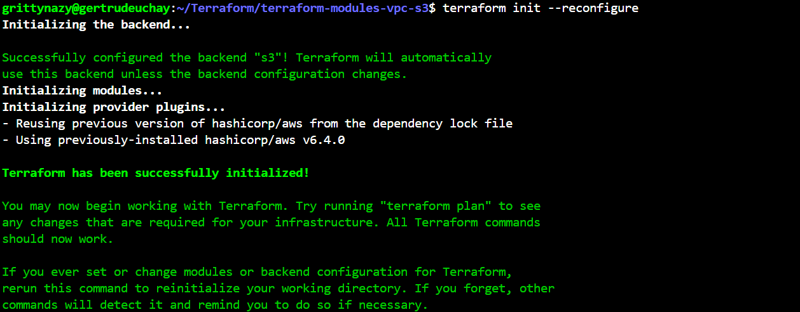

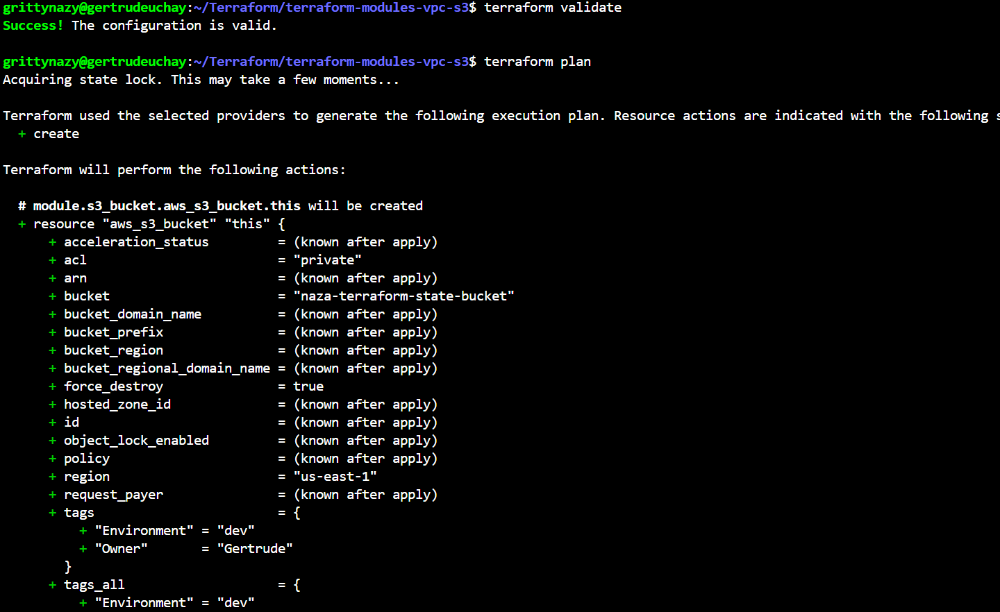

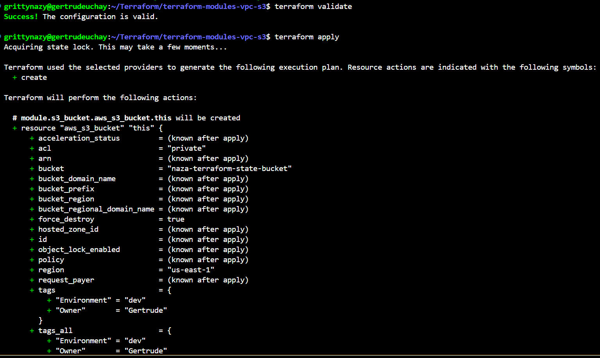

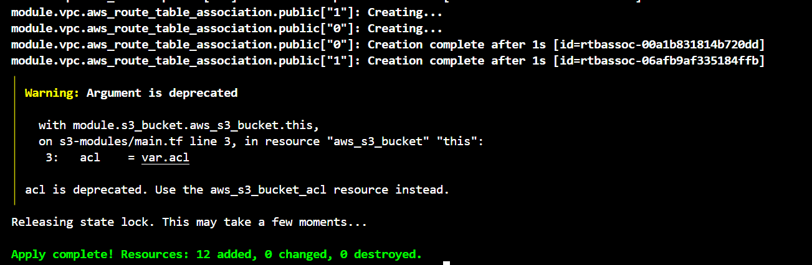

I then confirmed the setup on the console
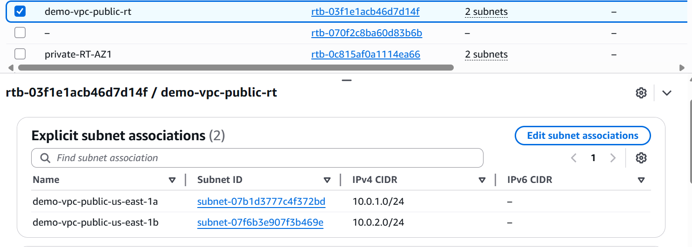

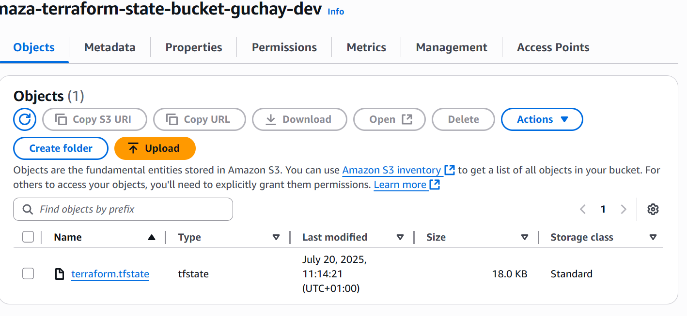

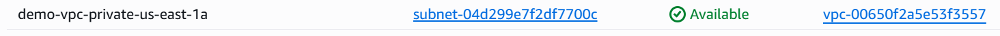