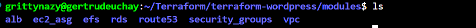

# TERRAFORM CAPSTONE PROJECT - AUTOMATED WORDPRESS DEPLOYMENT ON AWS
In this project, I designed and implemented a scalable, secure, and cost-effective Wordpress solution using various AWS services and I automated via terraform.

In the terraform scripts, I set up a VPC with 2 public subnets (for resources accessible from the internet) and 4 private subnets (for resources with no direct internet access), comprising of 2 appsubnets and 2 database subnets in 2 different availability zones

I also setup a public route table and 2 private route tables, an Internet gateway and 2 Nat Gateways in 2 different availability zones. I associated the public subnets with the public route table and created a route for internet gateway. I associated the private subnets with the private route table and created a route for the natgateways

I created security groups for the load balancer, the web server, the EFS and the database. For the ALB security group, I opened port 80 (http), port 443 (https) and ssh (22) and allowed traffic from anywhere. For the web server security group, I allowed traffic from the ALB security on port 80 and 443. For the EFS and database security groups, port 2049 and 3306 were opened simultaneously, allowing traffic from the Web server security group.

I deployed a managed MySQL database using Amazon RDS for Wordpress data storage. It was deployed in the private subnet with the master database in one availabilty zone and a standby database in a differenr availability zone. Th database security group initially created was attached to the database.

A launch template was setup with the wordpress configuration script. This launch template was used for the creation of an Autoscaling group and the desired capacity was set to 2. This automatically spun up 2 EC2 instances in 2 different availabilty zones in the private subnet. this is the launch template script

The wordpress servers were placed in a target group and used in the creation of a load balancer. Http and Https listeners were added and forwarded to the target group. A domain was registered in Route 53, hosted zone was created and records added. An SSL certificate was created using AWS Certificate Manager and was added to the https listener. The load balancer was set up to route http traffic to https.

Firstly, I created a root directory for the terraform project and created the modules directory which had sub directories for the alb, ec2_asg, efs, rds, route53 and security_group modules

I then manually created the remote backend s3 bucket and dynamodb table for state locking

I then ran terraform init, validate and apply and all my resources got created and I was able to access my wordpress website via my loadbalancer dns and my domain name

1

I then brought down the infrastructure by running terraform destroy
